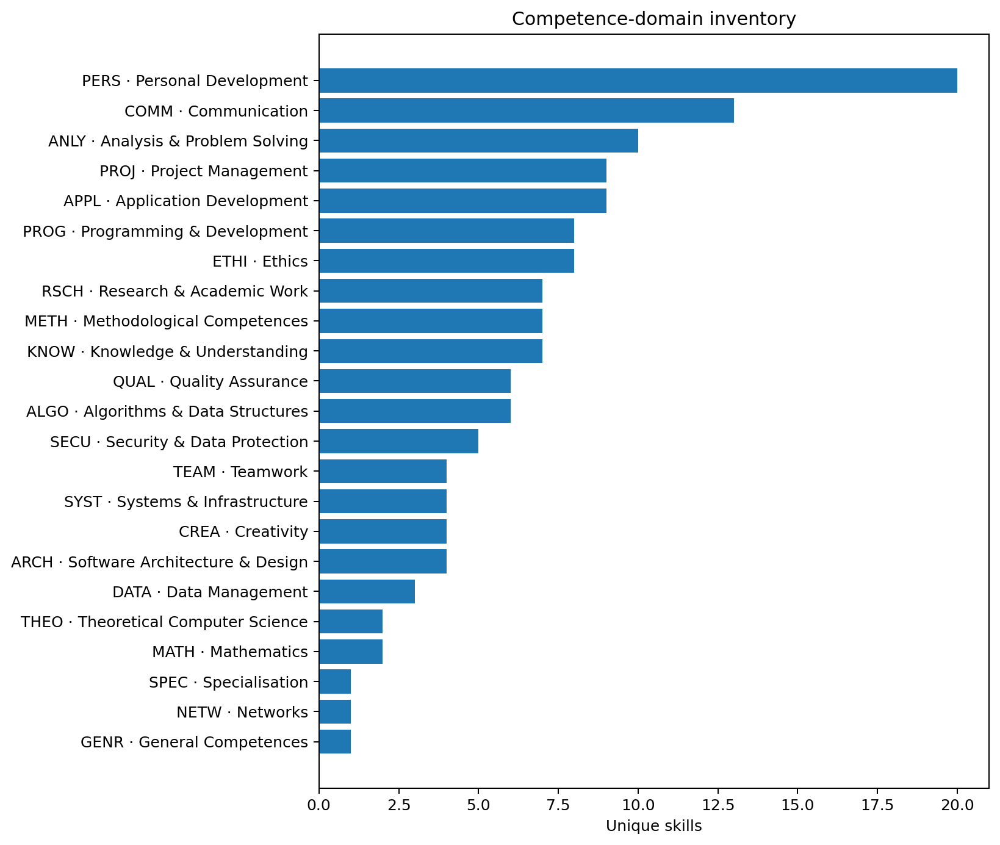
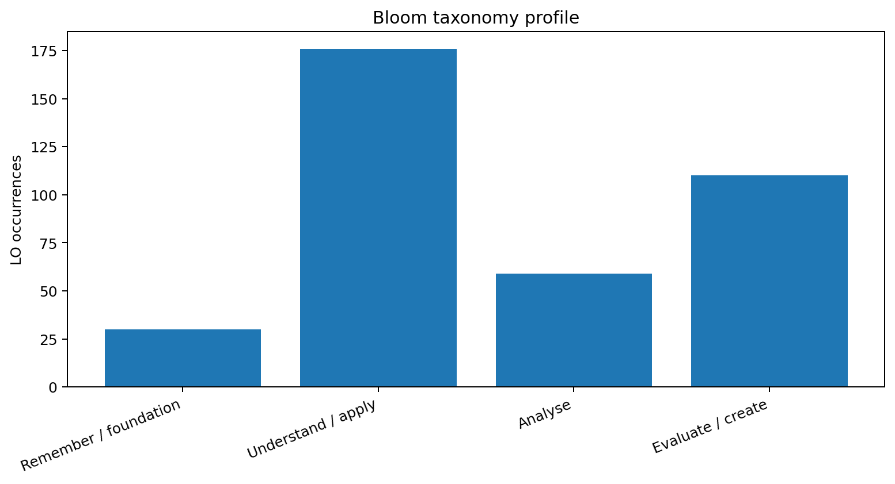
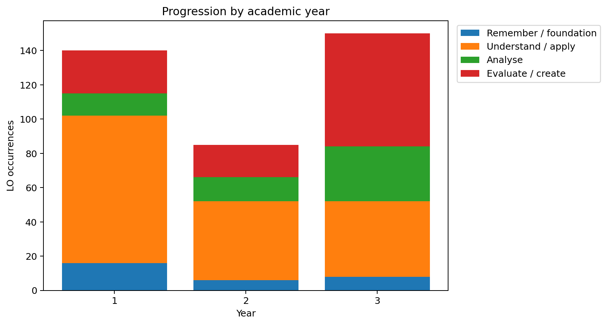
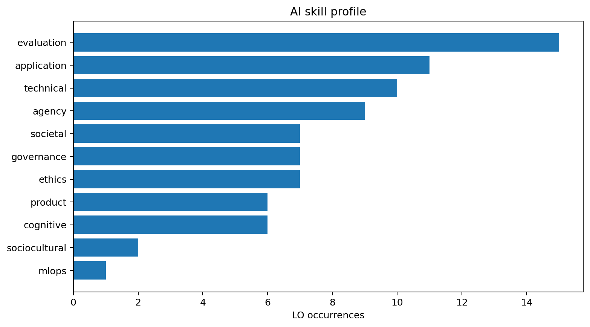
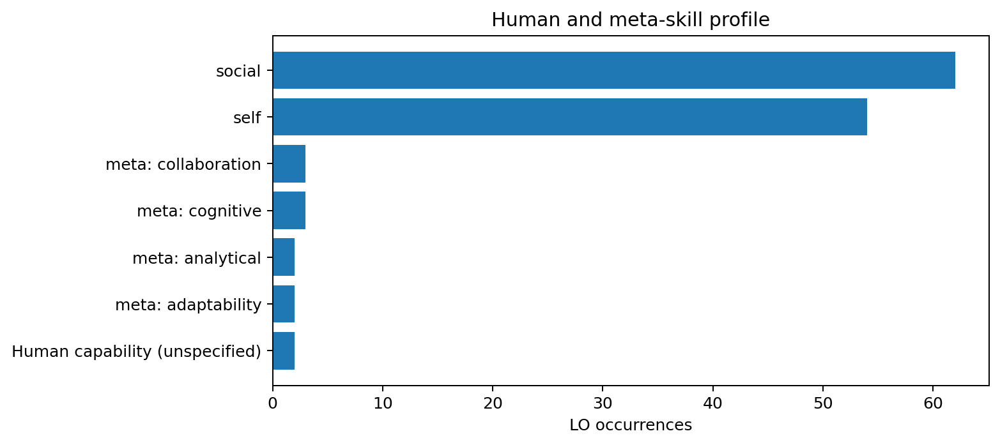
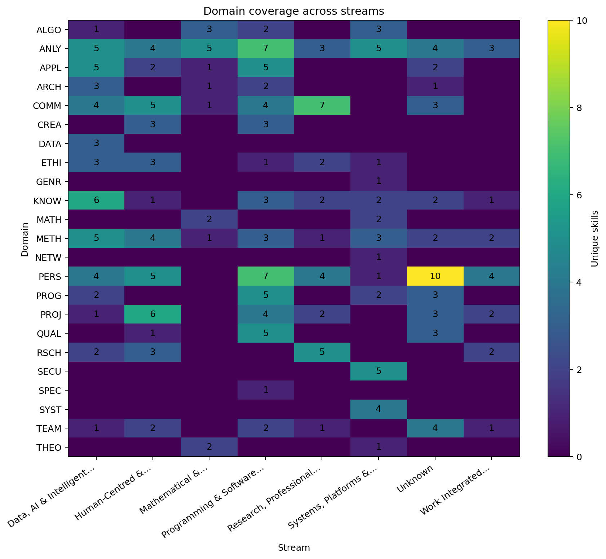

# OUG Skill Profile Atlas

**Open University of Germany (OUG)**  
Bachelor of Computer Science (B.Sc.)  
Assembled: 2026-07-30

> Generated from machine-readable module and competence data.

## Portfolio snapshot

| Measure | Value |
| --- | --- |
| Modules | 31 |
| Total ECTS | 192 |
| Unique skills | 141 |
| Domains touched | 23 |
| AI-related skills | 38 |
| Human-tagged skills | 57 |

## Module index

| Code | Module | Stream | Year | Semester | ECTS | Skills |
| --- | --- | --- | --- | --- | --- | --- |
| T4INF1601 | [Scientific Programming & Experimentation](#module-t4inf1601) | Data, AI & Intelligent Systems | 1 | — | 5 | 15 |
| T4INF1602 | [Foundation of Intelligent Systems](#module-t4inf1602) | Data, AI & Intelligent Systems | 1 | — | 5 | 16 |
| T4INF1001 | [Mathematics I — Linear Algebra](#module-t4inf1001) | Mathematical & Theoretical Foundations | 1 | — | 5 | 4 |
| T4INF1002 | [Theoretical Computer Science I — Logic and Formal Foundations](#module-t4inf1002) | Mathematical & Theoretical Foundations | 1 | — | 5 | 4 |
| T4INF1003 | [Theoretical Computer Science II — Algorithms and Complexity](#module-t4inf1003) | Mathematical & Theoretical Foundations | 1 | — | 5 | 4 |
| T4INF1007 | [Mathematics II — Analysis](#module-t4inf1007) | Mathematical & Theoretical Foundations | 1 | — | 5 | 3 |
| T4INF1004 | [Programming](#module-t4inf1004) | Programming & Software Construction | 1 | — | 5 | 17 |
| T4INF1101 | [Web & Application Engineering](#module-t4inf1101) | Programming & Software Construction | 1 | — | 5 | 15 |
| T4INF1005 | [Key Skills](#module-t4inf1005) | Research, Professional & Societal Practice | 1 | — | 5 | 11 |
| T4INF1006 | [Computer Engineering I — Digital Technology](#module-t4inf1006) | Systems, Platforms & Security | 1 | — | 5 | 8 |
| T4INF2003 | [Software Engineering Fundamentals](#module-t4inf2003) | Unknown | 1 | — | 5 | 37 |
| T4_1000 | [Work Integrated Project I](#module-t4_1000) | Work Integrated Learning / Praxisprojekte | 1 | — | 20 | 6 |
| T4INF2004 | [Database Systems](#module-t4inf2004) | Data, AI & Intelligent Systems | 2 | — | 6 | 15 |
| T4INF2601 | [Data Science](#module-t4inf2601) | Data, AI & Intelligent Systems | 2 | — | 5 | 18 |
| T4INF9006 | [Design Thinking](#module-t4inf9006) | Human-Centred & Societal Computing | 2 | — | 5 | 18 |
| T4INF2001 | [Mathematics III — Applied Mathematics and Statistics](#module-t4inf2001) | Mathematical & Theoretical Foundations | 2 | — | 6 | 4 |
| T4INF2002 | [Theoretical Computer Science III — Formal Languages and Compiler Construction](#module-t4inf2002) | Mathematical & Theoretical Foundations | 2 | — | 6 | 4 |
| T4INF2005 | [Computer Engineering II](#module-t4inf2005) | Systems, Platforms & Security | 2 | — | 8 | 10 |
| T4INF2006 | [IT Security](#module-t4inf2006) | Systems, Platforms & Security | 2 | — | 5 | 10 |
| T4_2000 | [Work Integrated Project II](#module-t4_2000) | Work Integrated Learning / Praxisprojekte | 2 | — | 20 | 6 |
| T4INF3103 | [Database Systems II](#module-t4inf3103) | Data, AI & Intelligent Systems | 3 | — | 5 | 17 |
| T4INF3915 | [Technology Seminar Applied Artificial Intelligence](#module-t4inf3915) | Data, AI & Intelligent Systems | 3 | — | 5 | 14 |
| T4INF4902.1 | [Selected Topics in Computer Science — Natural Language Processing](#module-t4inf4902-1) | Data, AI & Intelligent Systems | 3 | — | 5 | 13 |
| T4INF4348 | [Human-Machine Interaction](#module-t4inf4348) | Human-Centred & Societal Computing | 3 | — | 5 | 20 |
| T4INF4900 | [Gamification](#module-t4inf4900) | Human-Centred & Societal Computing | 3 | — | 5 | 14 |
| T4INF3102 | [Advanced Software Engineering](#module-t4inf3102) | Programming & Software Construction | 3 | — | 5 | 21 |
| T4INF4900.1 | [Games and Gaming](#module-t4inf4900-1) | Programming & Software Construction | 3 | — | 3 | 17 |
| T4INF3906 | [Applied Computer Science Research](#module-t4inf3906) | Research, Professional & Societal Practice | 3 | — | 5 | 10 |
| T4INF4324 | [Consulting, Technical Sales and Law](#module-t4inf4324) | Research, Professional & Societal Practice | 3 | — | 5 | 11 |
| T4INF4902 | [Quantum Computing](#module-t4inf4902) | Systems, Platforms & Security | 3 | — | 5 | 8 |
| T4_3000 | [Work Integrated Project III](#module-t4_3000) | Work Integrated Learning / Praxisprojekte | 3 | — | 8 | 5 |

## Executive skill profile

> **How to read this profile** — Counts show how often a competence appears across the selected modules. Unique-skill counts remove repetition, while learning-outcome occurrences show curricular emphasis. Bloom levels describe the cognitive demand encoded in the learning outcomes; they are not grades or performance results.

## Competence-domain inventory

| Domain | Domain name | Skills | Modules | LO occurrences | Years | Streams |
| --- | --- | --- | --- | --- | --- | --- |
| ALGO | Algorithms & Data Structures | 6 | 6 | 9 | 1, 2, 3 | Data, AI & Intelligent Systems, Mathematical & Theoretical Foundations, Programming & Software Construction, Systems, Platforms & Security |
| ANLY | Analysis & Problem Solving | 10 | 28 | 52 | 1, 2, 3 | Data, AI & Intelligent Systems, Human-Centred & Societal Computing, Mathematical & Theoretical Foundations, Programming & Software Construction, Research, Professional & Societal Practice, Systems, Platforms & Security, Unknown, Work Integrated Learning / Praxisprojekte |
| APPL | Application Development | 9 | 13 | 22 | 1, 2, 3 | Data, AI & Intelligent Systems, Human-Centred & Societal Computing, Mathematical & Theoretical Foundations, Programming & Software Construction, Unknown |
| ARCH | Software Architecture & Design | 4 | 11 | 11 | 1, 2, 3 | Data, AI & Intelligent Systems, Mathematical & Theoretical Foundations, Programming & Software Construction, Unknown |
| COMM | Communication | 13 | 17 | 30 | 1, 2, 3 | Data, AI & Intelligent Systems, Human-Centred & Societal Computing, Mathematical & Theoretical Foundations, Programming & Software Construction, Research, Professional & Societal Practice, Unknown |
| CREA | Creativity | 4 | 5 | 8 | 1, 2, 3 | Human-Centred & Societal Computing, Programming & Software Construction |
| DATA | Data Management | 3 | 2 | 4 | 2, 3 | Data, AI & Intelligent Systems |
| ETHI | Ethics | 8 | 8 | 13 | 1, 2, 3 | Data, AI & Intelligent Systems, Human-Centred & Societal Computing, Programming & Software Construction, Research, Professional & Societal Practice, Systems, Platforms & Security |
| GENR | General Competences | 1 | 1 | 1 | 1 | Systems, Platforms & Security |
| KNOW | Knowledge & Understanding | 7 | 19 | 37 | 1, 2, 3 | Data, AI & Intelligent Systems, Human-Centred & Societal Computing, Programming & Software Construction, Research, Professional & Societal Practice, Systems, Platforms & Security, Unknown, Work Integrated Learning / Praxisprojekte |
| MATH | Mathematics | 2 | 4 | 8 | 1, 2 | Mathematical & Theoretical Foundations, Systems, Platforms & Security |
| METH | Methodological Competences | 7 | 21 | 40 | 1, 2, 3 | Data, AI & Intelligent Systems, Human-Centred & Societal Computing, Mathematical & Theoretical Foundations, Programming & Software Construction, Research, Professional & Societal Practice, Systems, Platforms & Security, Unknown, Work Integrated Learning / Praxisprojekte |
| NETW | Networks | 1 | 1 | 1 | 2 | Systems, Platforms & Security |
| PERS | Personal Development | 20 | 22 | 43 | 1, 2, 3 | Data, AI & Intelligent Systems, Human-Centred & Societal Computing, Programming & Software Construction, Research, Professional & Societal Practice, Systems, Platforms & Security, Unknown, Work Integrated Learning / Praxisprojekte |
| PROG | Programming & Development | 8 | 11 | 21 | 1, 2, 3 | Data, AI & Intelligent Systems, Programming & Software Construction, Systems, Platforms & Security, Unknown |
| PROJ | Project Management | 9 | 10 | 20 | 1, 2, 3 | Data, AI & Intelligent Systems, Human-Centred & Societal Computing, Programming & Software Construction, Research, Professional & Societal Practice, Unknown, Work Integrated Learning / Praxisprojekte |
| QUAL | Quality Assurance | 6 | 6 | 11 | 1, 3 | Human-Centred & Societal Computing, Programming & Software Construction, Unknown |
| RSCH | Research & Academic Work | 7 | 8 | 15 | 1, 3 | Data, AI & Intelligent Systems, Human-Centred & Societal Computing, Research, Professional & Societal Practice, Work Integrated Learning / Praxisprojekte |
| SECU | Security & Data Protection | 5 | 1 | 5 | 2 | Systems, Platforms & Security |
| SPEC | Specialisation | 1 | 1 | 1 | 3 | Programming & Software Construction |
| SYST | Systems & Infrastructure | 4 | 3 | 5 | 1, 2 | Systems, Platforms & Security |
| TEAM | Teamwork | 4 | 10 | 14 | 1, 2, 3 | Data, AI & Intelligent Systems, Human-Centred & Societal Computing, Programming & Software Construction, Research, Professional & Societal Practice, Unknown, Work Integrated Learning / Praxisprojekte |
| THEO | Theoretical Computer Science | 2 | 4 | 4 | 1, 2, 3 | Mathematical & Theoretical Foundations, Systems, Platforms & Security |

## Bloom taxonomy profile

| Bloom level | LO occurrences | Skills | Modules |
| --- | --- | --- | --- |
| Remember / foundation | 30 | 8 | 19 |
| Understand / apply | 176 | 57 | 30 |
| Analyse | 59 | 28 | 26 |
| Evaluate / create | 110 | 48 | 27 |

## AI skill profile

> AI-related skills are identified from the codebook's AI flag, AI-domain labels, or AI-upskilling meta-skill marker. The report distinguishes the breadth of AI domains from repeated use of the same competence across modules.

| Code | Skill | Domain | Bloom level | AI domains | Modules |
| --- | --- | --- | --- | --- | --- |
| ALGO-2-02 | Applying optimisation methods to ML training | ALGO | Understand / apply | technical | T4INF2601 |
| ANLY-3-03 | Defining AI‑specific success metrics | ANLY | Analyse | evaluation, product | T4INF1003, T4INF2001 |
| ANLY-4-03 | Evaluating AI output | ANLY | Evaluate / create | evaluation | T4INF2003, T4INF3102, T4INF3915, T4INF4902.1 |
| ANLY-4-04 | Reflecting on AI's cognitive effects in analytical processes | ANLY | Evaluate / create | cognitive | T4INF3102, T4INF3915 |
| ANLY-4-05 | Evaluating factual consistency of LLM outputs | ANLY | Evaluate / create | evaluation | T4INF3915 |
| APPL-2-04 | Using AI tools | APPL | Understand / apply | application | T4INF1004, T4INF1101, T4INF1601, T4INF1602, T4INF2003, T4INF2601, T4INF3915 |
| APPL-2-05 | Structuring and optimising prompts for LLMs | APPL | Understand / apply | application | T4INF1602 |
| APPL-3-01 | Integrating AI tools into development workflows | APPL | Analyse | application, evaluation | T4INF4900.1, T4INF4902.1 |
| ARCH-3-02 | Designing Retrieval‑Augmented Generation (RAG) pipelines | ARCH | Analyse | application, evaluation | T4INF3915 |
| COMM-3-02 | Communicating about AI with non-technical audiences | COMM | Analyse | societal | T4INF4324 |
| COMM-3-03 | Handling AI uncertainty in stakeholder communication | COMM | Analyse | societal | T4INF4348 |
| COMM-4-01 | Negotiating cultural and social dimensions of AI in professional dialogue | COMM | Evaluate / create | sociocultural | T4INF4348 |
| COMM-4-03 | Facilitating ethical decision‑making (workshops, protocols) | COMM | Evaluate / create | governance | T4INF4348 |
| CREA-3-01 | Analysing AI's influence on creative processes | CREA | Analyse | cognitive | T4INF4900.1 |
| CREA-4-02 | Designing human-centred systems in AI-mediated contexts | CREA | Evaluate / create | agency, cognitive | T4INF4348 |
| ETHI-2-02 | Recognising AI bias and fairness issues | ETHI | Understand / apply | ethics | T4INF1602, T4INF2006, T4INF2601, T4INF4902.1 |
| ETHI-3-01 | Analysing AI's societal effects | ETHI | Analyse | societal | T4INF1602, T4INF2601, T4INF4900.1 |
| ETHI-3-02 | Conducting an algorithmic impact assessment (AIA) | ETHI | Analyse | ethics, governance | T4INF4348 |
| ETHI-4-01 | Evaluating AI governance frameworks | ETHI | Evaluate / create | governance | T4INF4348 |
| ETHI-4-02 | Reflecting on AI and social justice | ETHI | Evaluate / create | sociocultural | T4INF1602 |
| ETHI-4-03 | Assessing legal requirements for AI systems | ETHI | Evaluate / create | governance | T4INF4324 |
| ETHI-4-04 | Designing AI governance structures and policies | ETHI | Evaluate / create | governance | T4INF4324 |
| KNOW-1-05 | Knowing the foundational principles of AI systems | KNOW | Remember / foundation | technical | T4INF1602, T4INF2601 |
| KNOW-2-02 | Explaining how AI models work and where they fail | KNOW | Understand / apply | technical | T4INF2004, T4INF2601, T4INF3103, T4INF3915, T4INF4902.1 |
| METH-3-02 | Orchestrating ML workflows and tracking experiments | METH | Analyse | mlops | T4INF3915 |
| PERS-2-05 | Making independent decisions about AI use | PERS | Understand / apply | agency | T4INF1004, T4INF1101, T4INF1602, T4INF2601 |
| PERS-4-09 | Reflecting on AI use | PERS | Evaluate / create | agency | T4INF2003, T4INF3915, T4INF4900.1 |
| PERS-4-10 | Asserting human agency in AI-mediated contexts | PERS | Evaluate / create | agency | T4INF3906 |
| PERS-4-11 | Reflecting on AI's cognitive effects | PERS | Evaluate / create | cognitive | T4INF3906 |
| PROG-3-01 | Analysing AI-assisted software development processes | PROG | Analyse | evaluation, technical | T4INF3102 |
| PROJ-4-05 | Developing AI product strategy and roadmap | PROJ | Evaluate / create | product | T4INF4324, T4INF4900 |
| PROJ-4-06 | Evaluating business case and ROI for AI projects | PROJ | Evaluate / create | product | T4INF4324, T4INF4900 |
| RSCH-2-02 | Using AI responsibly in academic work | RSCH | Understand / apply | ethics, evaluation | T4INF1005, T4INF3906 |
| RSCH-3-01 | Analysing AI's effects on research and knowledge production | RSCH | Analyse | cognitive, societal | T4INF3906 |
| RSCH-4-02 | Evaluating AI systems as research objects | RSCH | Evaluate / create | evaluation | T4INF1601, T4INF3915 |
| RSCH-4-03 | Evaluating the societal implications of own work | RSCH | Evaluate / create | governance, societal | T4INF4348 |
| SECU-3-01 | Analysing AI-specific security risks | SECU | Analyse | technical | T4INF2006 |
| SECU-3-02 | Applying risk frameworks to AI systems | SECU | Analyse | governance | T4INF2006 |

## Human and meta-skill profile

> Human capability is represented through explicit human-skill tags, meta-skill categories and broader capability clusters. Empty fields are not interpreted as absence of human learning; they indicate that no explicit tag was present.

| Code | Skill | Human tag | Meta-skill category | Capability clusters | Modules |
| --- | --- | --- | --- | --- | --- |
| ALGO-4-02 | Recognising and abstracting patterns | — | analytical | cognitive, technological | T4INF3102 |
| ANLY-4-04 | Reflecting on AI's cognitive effects in analytical processes | self | — | cognitive, technological | T4INF3102, T4INF3915 |
| APPL-3-01 | Integrating AI tools into development workflows | self | — | creative-aesthetic, technological | T4INF4900.1, T4INF4902.1 |
| COMM-2-01 | Presenting results | social | — | human-social, personal-reflective | T4INF1005, T4INF1101, T4INF1601, T4INF2003, T4INF3915, T4INF4900, T4INF4900.1, T4INF4902.1 |
| COMM-2-02 | Communicating professionally | social | — | human-social, personal-reflective | T4INF1005 |
| COMM-2-03 | Documenting work | social | — | human-social, personal-reflective | T4INF1005 |
| COMM-2-04 | Describing content | social | — | human-social, personal-reflective | T4INF1005, T4INF2601, T4INF3906 |
| COMM-2-05 | Explaining relationships | social | — | human-social, personal-reflective | T4INF1005 |
| COMM-2-06 | Exchanging views with experts | social | — | human-social, personal-reflective | T4INF1002, T4INF1004, T4INF1601, T4INF2003, T4INF2004, T4INF3103 |
| COMM-3-01 | Analysing perspectives critically | social | — | human-social, personal-reflective | T4INF2003, T4INF3103 |
| COMM-3-02 | Communicating about AI with non-technical audiences | social | — | human-social, personal-reflective | T4INF4324 |
| COMM-3-03 | Handling AI uncertainty in stakeholder communication | social | — | human-social, personal-reflective | T4INF4348 |
| COMM-4-01 | Negotiating cultural and social dimensions of AI in professional dialogue | social | — | human-social, personal-reflective | T4INF4348 |
| COMM-4-02 | Integrating cross-disciplinary perspectives | social | — | human-social, personal-reflective | T4INF4324, T4INF4348, T4INF4900.1 |
| COMM-4-03 | Facilitating ethical decision‑making (workshops, protocols) | social | — | human-social, personal-reflective | T4INF4348 |
| COMM-4-04 | Documenting decisions (Architecture Decision Records) | social | collaboration | human-social, personal-reflective | T4INF3102 |
| CREA-3-01 | Analysing AI's influence on creative processes | self | — | creative-aesthetic, human-social | T4INF4900.1 |
| CREA-4-02 | Designing human-centred systems in AI-mediated contexts | self | — | creative-aesthetic, human-social | T4INF4348 |
| ETHI-2-02 | Recognising AI bias and fairness issues | self | — | human-social, personal-reflective | T4INF1602, T4INF2006, T4INF2601, T4INF4902.1 |
| ETHI-3-01 | Analysing AI's societal effects | social | — | human-social, personal-reflective | T4INF1602, T4INF2601, T4INF4900.1 |
| ETHI-3-02 | Conducting an algorithmic impact assessment (AIA) | social | — | human-social, personal-reflective | T4INF4348 |
| ETHI-4-02 | Reflecting on AI and social justice | social | — | human-social, personal-reflective | T4INF1602 |
| ETHI-4-04 | Designing AI governance structures and policies | social | — | human-social, personal-reflective | T4INF4324 |
| PERS-2-01 | Adapting to new situations | self | — | human-social, personal-reflective | T4INF3102, T4INF4900 |
| PERS-2-02 | Giving and receiving feedback | social | — | human-social, personal-reflective | T4INF2003 |
| PERS-2-03 | Sharing expertise | social | — | human-social, personal-reflective | T4INF2003 |
| PERS-2-04 | Working independently | self | — | human-social, personal-reflective | T4INF1004, T4INF1101, T4INF1601, T4INF1602, T4INF2003, T4INF2004, T4INF2601, T4INF4902.1 |
| PERS-2-05 | Making independent decisions about AI use | self | — | human-social, personal-reflective | T4INF1004, T4INF1101, T4INF1602, T4INF2601 |
| PERS-4-01 | Identifying strengths and weaknesses | self | — | human-social, personal-reflective | T4_1000, T4INF2003 |
| PERS-4-02 | Taking responsibility | self | — | human-social, personal-reflective | T4_1000, T4INF1005, T4INF4324 |
| PERS-4-03 | Making adjustments | self | — | human-social, personal-reflective | T4INF2003 |
| PERS-4-04 | Reflecting critically | self | — | human-social, personal-reflective | T4_3000, T4INF2003, T4INF3102 |
| PERS-4-05 | Developing critical judgement | self | — | human-social, personal-reflective | T4INF3102, T4INF3103 |
| PERS-4-06 | Resolving conflicts | social | — | human-social, personal-reflective | T4INF2003 |
| PERS-4-07 | Improving purposefully | self | — | human-social, personal-reflective | T4_2000, T4INF2003 |
| PERS-4-08 | Deriving improvements | self | — | human-social, personal-reflective | T4INF2003 |
| PERS-4-09 | Reflecting on AI use | self | — | human-social, personal-reflective | T4INF2003, T4INF3915, T4INF4900.1 |
| PERS-4-10 | Asserting human agency in AI-mediated contexts | self | — | human-social, personal-reflective | T4INF3906 |
| PERS-4-11 | Reflecting on AI's cognitive effects | self | — | human-social, personal-reflective | T4INF3906 |
| PERS-4-12 | Reflecting on uncertainty and developing personal resilience | self | — | human-social, personal-reflective | T4INF4900.1, T4INF9006 |
| PERS-4-13 | Recognising and communicating the limits of one's own knowledge | self | cognitive | human-social, personal-reflective | T4INF9006 |
| PERS-4-14 | Reflecting on and adapting learning strategies | self | cognitive | human-social, personal-reflective | T4INF1005, T4INF4900 |
| PERS-4-15 | Embracing and navigating change as an opportunity | self | adaptability | human-social, personal-reflective | T4INF4348, T4INF4902 |
| PROG-3-02 | Analysing and extending existing codebases | social | — | cognitive, technological | T4INF4900.1 |
| PROJ-3-02 | Analysing uncertainty in project planning | self | — | cognitive, human-social | T4INF4900.1 |
| PROJ-4-03 | Establishing and aligning a shared project vision | social | — | cognitive, human-social | T4INF4900.1, T4INF9006 |
| PROJ-4-04 | Controlling scope evolution in iterative development | social | — | cognitive, human-social | T4INF4900.1 |
| PROJ-4-05 | Developing AI product strategy and roadmap | social | — | cognitive, human-social | T4INF4324, T4INF4900 |
| PROJ-4-07 | Negotiating priorities and saying 'no' with justification | social | collaboration | cognitive, human-social | T4INF4900, T4INF9006 |
| QUAL-4-01 | Conducting systematic failure analysis | — | analytical | creative-aesthetic, technological | T4INF3102 |
| RSCH-2-02 | Using AI responsibly in academic work | self | — | cognitive, personal-reflective | T4INF1005, T4INF3906 |
| RSCH-3-01 | Analysing AI's effects on research and knowledge production | self | — | cognitive, personal-reflective | T4INF3906 |
| RSCH-4-03 | Evaluating the societal implications of own work | social | — | cognitive, personal-reflective | T4INF4348 |
| TEAM-2-01 | Contributing to teams | social | — | human-social, personal-reflective | T4_2000, T4INF1101, T4INF1601, T4INF2003, T4INF3102, T4INF3103, T4INF9006 |
| TEAM-2-02 | Acting team-orientedly | social | — | human-social, personal-reflective | T4INF2003, T4INF3906 |
| TEAM-2-03 | Fostering collaboration | social | — | human-social, personal-reflective | T4INF2003 |
| TEAM-4-01 | Building teams | social | — | human-social, personal-reflective | T4INF2003, T4INF4348, T4INF4900.1, T4INF9006 |

## Progression by academic year

| Progression by academic year | Modules | Total ECTS | Unique skills | Domains touched | AI-related skills | Human-tagged skills |
| --- | --- | --- | --- | --- | --- | --- |
| 1 | 12 | 75 | 75 | 19 | 12 | 28 |
| 2 | 8 | 61 | 63 | 19 | 10 | 13 |
| 3 | 11 | 56 | 91 | 18 | 30 | 43 |

### 1

**Modules:** T4_1000, T4INF1001, T4INF1002, T4INF1003, T4INF1004, T4INF1005, T4INF1006, T4INF1007, T4INF1101, T4INF1601, T4INF1602, T4INF2003  
**Domains touched:** PERS (21), ANLY (17), KNOW (16), COMM (13), APPL (12), PROG (11), METH (9), MATH (6), QUAL (6), TEAM (6), ARCH (5), RSCH (4), ALGO (4), ETHI (3), PROJ (3), THEO (1), SYST (1), GENR (1), CREA (1)  
**Bloom level:** Remember / foundation (16), Understand / apply (86), Evaluate / create (25), Analyse (13)

### 2

**Modules:** T4_2000, T4INF2001, T4INF2002, T4INF2004, T4INF2005, T4INF2006, T4INF2601, T4INF9006  
**Domains touched:** ANLY (13), METH (13), KNOW (9), PROJ (6), PERS (6), APPL (5), SECU (5), SYST (4), PROG (4), TEAM (3), ETHI (3), MATH (2), THEO (2), ARCH (2), COMM (2), DATA (2), CREA (2), NETW (1), ALGO (1)  
**Bloom level:** Analyse (14), Understand / apply (46), Evaluate / create (19), Remember / foundation (6)

### 3

**Modules:** T4_3000, T4INF3102, T4INF3103, T4INF3906, T4INF3915, T4INF4324, T4INF4348, T4INF4900, T4INF4900.1, T4INF4902, T4INF4902.1  
**Domains touched:** ANLY (22), METH (18), PERS (16), COMM (15), KNOW (12), RSCH (11), PROJ (11), ETHI (7), PROG (6), QUAL (5), TEAM (5), APPL (5), CREA (5), ARCH (4), ALGO (4), DATA (2), SPEC (1), THEO (1)  
**Bloom level:** Evaluate / create (66), Analyse (32), Understand / apply (44), Remember / foundation (8)

## Profiles by stream

| Profiles by stream | Modules | Total ECTS | Unique skills | Domains touched | AI-related skills | Human-tagged skills |
| --- | --- | --- | --- | --- | --- | --- |
| Data, AI & Intelligent Systems | 7 | 36 | 45 | 14 | 17 | 14 |
| Human-Centred & Societal Computing | 3 | 15 | 39 | 12 | 9 | 18 |
| Mathematical & Theoretical Foundations | 6 | 32 | 16 | 8 | 1 | 1 |
| Programming & Software Construction | 4 | 18 | 54 | 15 | 9 | 23 |
| Research, Professional & Societal Practice | 3 | 15 | 27 | 9 | 9 | 16 |
| Systems, Platforms & Security | 4 | 23 | 31 | 13 | 3 | 2 |
| Unknown | 1 | 5 | 37 | 11 | 3 | 17 |
| Work Integrated Learning / Praxisprojekte | 3 | 48 | 15 | 7 | 0 | 5 |

### Data, AI & Intelligent Systems

**Modules:** T4INF1601, T4INF1602, T4INF2004, T4INF2601, T4INF3103, T4INF3915, T4INF4902.1  
**Domains touched:** KNOW (21), METH (18), ANLY (11), APPL (10), PROG (9), PERS (9), COMM (8), ETHI (6), ARCH (5), DATA (4), RSCH (3), TEAM (2), PROJ (1), ALGO (1)  
**Bloom level:** Remember / foundation (12), Understand / apply (58), Analyse (17), Evaluate / create (21)

### Human-Centred & Societal Computing

**Modules:** T4INF4348, T4INF4900, T4INF9006  
**Domains touched:** METH (8), PROJ (8), ANLY (6), CREA (5), COMM (5), PERS (5), KNOW (3), ETHI (3), RSCH (3), TEAM (3), APPL (2), QUAL (1)  
**Bloom level:** Remember / foundation (3), Understand / apply (17), Analyse (6), Evaluate / create (26)

### Mathematical & Theoretical Foundations

**Modules:** T4INF1001, T4INF1002, T4INF1003, T4INF1007, T4INF2001, T4INF2002  
**Domains touched:** ANLY (7), MATH (6), ALGO (3), APPL (2), THEO (2), COMM (1), ARCH (1), METH (1)  
**Bloom level:** Understand / apply (14), Evaluate / create (4), Remember / foundation (1), Analyse (4)

### Programming & Software Construction

**Modules:** T4INF1004, T4INF1101, T4INF3102, T4INF4900.1  
**Domains touched:** PERS (9), ANLY (8), PROG (7), QUAL (7), APPL (6), KNOW (5), METH (5), COMM (5), ARCH (4), PROJ (4), CREA (3), TEAM (3), ALGO (2), SPEC (1), ETHI (1)  
**Bloom level:** Remember / foundation (4), Understand / apply (30), Analyse (15), Evaluate / create (21)

### Research, Professional & Societal Practice

**Modules:** T4INF1005, T4INF3906, T4INF4324  
**Domains touched:** COMM (8), RSCH (7), PERS (5), ANLY (4), KNOW (2), ETHI (2), PROJ (2), TEAM (1), METH (1)  
**Bloom level:** Remember / foundation (2), Understand / apply (15), Evaluate / create (13), Analyse (2)

### Systems, Platforms & Security

**Modules:** T4INF1006, T4INF2005, T4INF2006, T4INF4902  
**Domains touched:** ANLY (7), SYST (5), SECU (5), KNOW (3), METH (3), ALGO (3), MATH (2), PROG (2), THEO (2), GENR (1), NETW (1), ETHI (1), PERS (1)  
**Bloom level:** Remember / foundation (5), Understand / apply (19), Analyse (8), Evaluate / create (4)

### Unknown

**Modules:** T4INF2003  
**Domains touched:** PERS (10), ANLY (4), TEAM (4), PROG (3), QUAL (3), COMM (3), PROJ (3), KNOW (2), APPL (2), METH (2), ARCH (1)  
**Bloom level:** Remember / foundation (2), Understand / apply (18), Analyse (4), Evaluate / create (13)

### Work Integrated Learning / Praxisprojekte

**Modules:** T4_1000, T4_2000, T4_3000  
**Domains touched:** ANLY (5), PERS (4), RSCH (2), METH (2), PROJ (2), KNOW (1), TEAM (1)  
**Bloom level:** Remember / foundation (1), Understand / apply (5), Evaluate / create (8), Analyse (3)

## Domain coverage across streams

## Module skill profiles

### T4INF1601 · Scientific Programming & Experimentation

**Stream:** Data, AI & Intelligent Systems  
**Year:** 1  
**Semester:** —  
**ECTS:** 5  
**Source file:** `T4INF1601_ooapi_v6.json`

Programming language concepts; programming in an appropriate language (variables, data types, control structures, data structures, modularisation); scientific computing with appropriate tools; data preprocessing; statistical analysis; data visualisation; responsible use of AI-assisted tools in data analysis.

| Code | Skill | Domain | Bloom level | AI | Human |
| --- | --- | --- | --- | --- | --- |
| ANLY-3-01 | Analysing problem statements | ANLY | Analyse | — | — |
| APPL-2-02 | Using tools | APPL | Understand / apply | — | — |
| APPL-2-04 | Using AI tools | APPL | Understand / apply | Yes | — |
| ARCH-2-02 | Designing solutions | ARCH | Understand / apply | — | — |
| COMM-2-01 | Presenting results | COMM | Understand / apply | — | social |
| COMM-2-06 | Exchanging views with experts | COMM | Understand / apply | — | social |
| KNOW-1-02 | Knowing foundational concepts | KNOW | Remember / foundation | — | — |
| KNOW-1-03 | Knowing terms and roles | KNOW | Remember / foundation | — | — |
| KNOW-2-01 | Understanding interdependencies | KNOW | Understand / apply | — | — |
| METH-2-02 | Applying methods | METH | Understand / apply | — | — |
| PERS-2-04 | Working independently | PERS | Understand / apply | — | self |
| PROG-2-03 | Implementing solutions | PROG | Understand / apply | — | — |
| PROG-4-01 | Developing software | PROG | Evaluate / create | — | — |
| RSCH-4-02 | Evaluating AI systems as research objects | RSCH | Evaluate / create | Yes | — |
| TEAM-2-01 | Contributing to teams | TEAM | Understand / apply | — | social |

[↑ Back to module index](#module-index)

### T4INF1602 · Foundation of Intelligent Systems

**Stream:** Data, AI & Intelligent Systems  
**Year:** 1  
**Semester:** —  
**ECTS:** 5  
**Source file:** `T4INF1602_ooapi_v6.json`

Unit 1 (Algorithms): Fundamental concepts and algorithms for intelligent systems; bionic foundations; evolutionary algorithms; regressor and classifier; introduction to neural networks. Unit 2 (Ethics & Law): Foundations of ethics in CS; compliance; GDPR; criminal law; civil liability; copyright; patent law; societal effects of AI systems.

| Code | Skill | Domain | Bloom level | AI | Human |
| --- | --- | --- | --- | --- | --- |
| APPL-2-04 | Using AI tools | APPL | Understand / apply | Yes | — |
| APPL-2-05 | Structuring and optimising prompts for LLMs | APPL | Understand / apply | Yes | — |
| ARCH-2-02 | Designing solutions | ARCH | Understand / apply | — | — |
| ETHI-2-02 | Recognising AI bias and fairness issues | ETHI | Understand / apply | Yes | self |
| ETHI-3-01 | Analysing AI's societal effects | ETHI | Analyse | Yes | social |
| ETHI-4-02 | Reflecting on AI and social justice | ETHI | Evaluate / create | Yes | social |
| KNOW-1-02 | Knowing foundational concepts | KNOW | Remember / foundation | — | — |
| KNOW-1-03 | Knowing terms and roles | KNOW | Remember / foundation | — | — |
| KNOW-1-05 | Knowing the foundational principles of AI systems | KNOW | Remember / foundation | Yes | — |
| METH-2-01 | Selecting methods | METH | Understand / apply | — | — |
| METH-2-02 | Applying methods | METH | Understand / apply | — | — |
| METH-3-01 | Transferring theoretical knowledge to complex real-world contexts | METH | Analyse | — | — |
| PERS-2-04 | Working independently | PERS | Understand / apply | — | self |
| PERS-2-05 | Making independent decisions about AI use | PERS | Understand / apply | Yes | self |
| PROG-2-03 | Implementing solutions | PROG | Understand / apply | — | — |
| PROG-4-01 | Developing software | PROG | Evaluate / create | — | — |

[↑ Back to module index](#module-index)

### T4INF1001 · Mathematics I — Linear Algebra

**Stream:** Mathematical & Theoretical Foundations  
**Year:** 1  
**Semester:** —  
**ECTS:** 5  
**Source file:** `T4INF1001_ooapi_v6.json`

Foundations of discrete mathematics; fundamental algebraic structures; vector spaces and linear mappings; determinants, eigenvalues, diagonalisability; complex numbers; application examples from computer science and engineering.

| Code | Skill | Domain | Bloom level | AI | Human |
| --- | --- | --- | --- | --- | --- |
| ANLY-2-03 | Understanding concepts | ANLY | Understand / apply | — | — |
| APPL-4-02 | Transferring concepts to problems | APPL | Evaluate / create | — | — |
| MATH-2-01 | Applying mathematical methods | MATH | Understand / apply | — | — |
| MATH-2-02 | Mastering formal methods | MATH | Understand / apply | — | — |

[↑ Back to module index](#module-index)

### T4INF1002 · Theoretical Computer Science I — Logic and Formal Foundations

**Stream:** Mathematical & Theoretical Foundations  
**Year:** 1  
**Semester:** —  
**ECTS:** 5  
**Source file:** `T4INF1002_ooapi_v6.json`

Algebraic structures: relations, orderings, mappings; formal logic: propositional logic, predicate logic; algorithm theory: recursion, termination and complexity, correctness; basic knowledge of declarative programming (logical/functional).

| Code | Skill | Domain | Bloom level | AI | Human |
| --- | --- | --- | --- | --- | --- |
| ALGO-1-01 | Knowing algorithms | ALGO | Remember / foundation | — | — |
| ANLY-2-02 | Solving problems | ANLY | Understand / apply | — | — |
| COMM-2-06 | Exchanging views with experts | COMM | Understand / apply | — | social |
| THEO-2-01 | Transferring theoretical knowledge | THEO | Understand / apply | — | — |

[↑ Back to module index](#module-index)

### T4INF1003 · Theoretical Computer Science II — Algorithms and Complexity

**Stream:** Mathematical & Theoretical Foundations  
**Year:** 1  
**Semester:** —  
**ECTS:** 5  
**Source file:** `T4INF1003_ooapi_v6.json`

Introduction to algorithms; complexity theory: O-notation, complexity classes (P, NP, NP-complete); search and sorting algorithms, hashing; correctness of algorithms; data structures: sets, lists, stacks, queues; trees, binary search trees, balanced graphs and graph algorithms; coding: compression, error-detecting and error-correcting codes.

| Code | Skill | Domain | Bloom level | AI | Human |
| --- | --- | --- | --- | --- | --- |
| ALGO-3-01 | Analysing complexity | ALGO | Analyse | — | — |
| ALGO-4-01 | Designing algorithms | ALGO | Evaluate / create | — | — |
| ANLY-2-01 | Classifying information | ANLY | Understand / apply | — | — |
| ANLY-3-03 | Defining AI‑specific success metrics | ANLY | Analyse | Yes | — |

[↑ Back to module index](#module-index)

### T4INF1007 · Mathematics II — Analysis

**Stream:** Mathematical & Theoretical Foundations  
**Year:** 1  
**Semester:** —  
**ECTS:** 5  
**Source file:** `T4INF1007_ooapi_v6.json`

Analysis: sequences and series; continuity; differential calculus of one real variable; integral calculus of one real variable; applications in computer science and engineering; first implementation of mathematical algorithms as programmes.

| Code | Skill | Domain | Bloom level | AI | Human |
| --- | --- | --- | --- | --- | --- |
| ANLY-2-03 | Understanding concepts | ANLY | Understand / apply | — | — |
| MATH-2-01 | Applying mathematical methods | MATH | Understand / apply | — | — |
| MATH-2-02 | Mastering formal methods | MATH | Understand / apply | — | — |

[↑ Back to module index](#module-index)

### T4INF1004 · Programming

**Stream:** Programming & Software Construction  
**Year:** 1  
**Semester:** —  
**ECTS:** 5  
**Source file:** `T4INF1004_ooapi_v6.json`

Procedural programming: algorithm description, data types, I/O, control structures, functions, string processing, structured and dynamic data types, pointers, memory management. Object-oriented programming: OOP design, class concept, inheritance, polymorphism, templates/generics, class libraries, garbage collection.

| Code | Skill | Domain | Bloom level | AI | Human |
| --- | --- | --- | --- | --- | --- |
| ALGO-2-01 | Applying data structures | ALGO | Understand / apply | — | — |
| ANLY-2-02 | Solving problems | ANLY | Understand / apply | — | — |
| ANLY-3-01 | Analysing problem statements | ANLY | Analyse | — | — |
| APPL-2-02 | Using tools | APPL | Understand / apply | — | — |
| APPL-2-04 | Using AI tools | APPL | Understand / apply | Yes | — |
| ARCH-2-02 | Designing solutions | ARCH | Understand / apply | — | — |
| COMM-2-06 | Exchanging views with experts | COMM | Understand / apply | — | social |
| KNOW-1-02 | Knowing foundational concepts | KNOW | Remember / foundation | — | — |
| KNOW-1-03 | Knowing terms and roles | KNOW | Remember / foundation | — | — |
| METH-2-02 | Applying methods | METH | Understand / apply | — | — |
| PERS-2-04 | Working independently | PERS | Understand / apply | — | self |
| PERS-2-05 | Making independent decisions about AI use | PERS | Understand / apply | Yes | self |
| PROG-2-01 | Applying programming paradigms | PROG | Understand / apply | — | — |
| PROG-2-03 | Implementing solutions | PROG | Understand / apply | — | — |
| PROG-4-01 | Developing software | PROG | Evaluate / create | — | — |
| QUAL-2-01 | Testing software | QUAL | Understand / apply | — | — |
| QUAL-3-01 | Evaluating code quality | QUAL | Analyse | — | — |

[↑ Back to module index](#module-index)

### T4INF1101 · Web & Application Engineering

**Stream:** Programming & Software Construction  
**Year:** 1  
**Semester:** —  
**ECTS:** 5  
**Source file:** `T4INF1101_ooapi_v6.json`

Client-server architectures and internet protocols; markup and styling languages for web content; client-side and server-side programming; frameworks and libraries; architectural patterns for modern web applications; user-centred design and accessibility; responsible use of AI-assisted development tools; web projects (individual and group work).

| Code | Skill | Domain | Bloom level | AI | Human |
| --- | --- | --- | --- | --- | --- |
| APPL-2-01 | Integrating into contexts | APPL | Understand / apply | — | — |
| APPL-2-03 | Implementing user interfaces | APPL | Understand / apply | — | — |
| APPL-2-04 | Using AI tools | APPL | Understand / apply | Yes | — |
| ARCH-2-02 | Designing solutions | ARCH | Understand / apply | — | — |
| COMM-2-01 | Presenting results | COMM | Understand / apply | — | social |
| CREA-2-01 | Applying user-centred design principles | CREA | Understand / apply | — | — |
| KNOW-1-02 | Knowing foundational concepts | KNOW | Remember / foundation | — | — |
| KNOW-1-03 | Knowing terms and roles | KNOW | Remember / foundation | — | — |
| KNOW-2-01 | Understanding interdependencies | KNOW | Understand / apply | — | — |
| METH-2-01 | Selecting methods | METH | Understand / apply | — | — |
| PERS-2-04 | Working independently | PERS | Understand / apply | — | self |
| PERS-2-05 | Making independent decisions about AI use | PERS | Understand / apply | Yes | self |
| PROG-4-01 | Developing software | PROG | Evaluate / create | — | — |
| QUAL-2-03 | Applying accessibility guidelines | QUAL | Understand / apply | — | — |
| TEAM-2-01 | Contributing to teams | TEAM | Understand / apply | — | social |

[↑ Back to module index](#module-index)

### T4INF1005 · Key Skills

**Stream:** Research, Professional & Societal Practice  
**Year:** 1  
**Semester:** —  
**ECTS:** 5  
**Source file:** `T4INF1005_ooapi_v6.json`

Unit 1 — Business Management: foundations of business management (goals, planning, legal forms), accounting and cost accounting, financing and investment, holistic business simulation. Unit 2 — Academic Writing: literature research and evaluation, substantive and formal aspects of scholarly work, technical and academic document types, producing short reports (DE/EN), exemplary project documentation. Unit 3 — Presentation, Learning and Working Techniques: presentation techniques and visualisation, learning and working techniques, responsible use of AI tools in academic work, reflection on own learning strategies, professional self-concept.

| Code | Skill | Domain | Bloom level | AI | Human |
| --- | --- | --- | --- | --- | --- |
| ANLY-2-03 | Understanding concepts | ANLY | Understand / apply | — | — |
| COMM-2-01 | Presenting results | COMM | Understand / apply | — | social |
| COMM-2-02 | Communicating professionally | COMM | Understand / apply | — | social |
| COMM-2-03 | Documenting work | COMM | Understand / apply | — | social |
| COMM-2-04 | Describing content | COMM | Understand / apply | — | social |
| COMM-2-05 | Explaining relationships | COMM | Understand / apply | — | social |
| KNOW-1-01 | Possessing subject knowledge | KNOW | Remember / foundation | — | — |
| PERS-4-02 | Taking responsibility | PERS | Evaluate / create | — | self |
| PERS-4-14 | Reflecting on and adapting learning strategies | PERS | Evaluate / create | — | cognitive, self |
| RSCH-2-01 | Researching literature | RSCH | Understand / apply | — | — |
| RSCH-2-02 | Using AI responsibly in academic work | RSCH | Understand / apply | Yes | self |

[↑ Back to module index](#module-index)

### T4INF1006 · Computer Engineering I — Digital Technology

**Stream:** Systems, Platforms & Security  
**Year:** 1  
**Semester:** —  
**ECTS:** 5  
**Source file:** `T4INF1006_ooapi_v6.json`

Number systems and codes; logical operations and their representation; switching algebra and formal methods (normal forms, K-maps); combinational circuits: analysis and design; sequential circuits: state machines, state diagrams; circuit technology and interfacing; semiconductor memory. Foundation for computer architecture, operating systems, and system-level programming.

| Code | Skill | Domain | Bloom level | AI | Human |
| --- | --- | --- | --- | --- | --- |
| ANLY-2-02 | Solving problems | ANLY | Understand / apply | — | — |
| ANLY-3-01 | Analysing problem statements | ANLY | Analyse | — | — |
| GENR-1-01 | Possessing professional capabilities | GENR | Remember / foundation | — | — |
| KNOW-1-02 | Knowing foundational concepts | KNOW | Remember / foundation | — | — |
| MATH-2-01 | Applying mathematical methods | MATH | Understand / apply | — | — |
| MATH-2-02 | Mastering formal methods | MATH | Understand / apply | — | — |
| METH-2-02 | Applying methods | METH | Understand / apply | — | — |
| SYST-2-02 | Programming at system level | SYST | Understand / apply | — | — |

[↑ Back to module index](#module-index)

### T4INF2003 · Software Engineering Fundamentals

**Stream:** Unknown  
**Year:** 1  
**Semester:** —  
**ECTS:** 5  
**Source file:** `T4INF2003_ooapi_v6.json`

Software process models; phases of software engineering and their relationships; requirements engineering and management, use cases; analysis and design models (e.g. UML, SADT); software architectures, interface design, software design and design patterns; code guidelines and code quality: reviewing and test planning, execution and evaluation; continuous integration; version control; operation and maintenance; phase-specific documentation; execution of a concrete software development project in medium-sized project teams

| Code | Skill | Domain | Bloom level | AI | Human |
| --- | --- | --- | --- | --- | --- |
| ANLY-2-02 | Solving problems | ANLY | Understand / apply | — | — |
| ANLY-3-01 | Analysing problem statements | ANLY | Analyse | — | — |
| ANLY-4-01 | Evaluating solution approaches | ANLY | Evaluate / create | — | — |
| ANLY-4-03 | Evaluating AI output | ANLY | Evaluate / create | Yes | — |
| APPL-2-02 | Using tools | APPL | Understand / apply | — | — |
| APPL-2-04 | Using AI tools | APPL | Understand / apply | Yes | — |
| ARCH-2-02 | Designing solutions | ARCH | Understand / apply | — | — |
| COMM-2-01 | Presenting results | COMM | Understand / apply | — | social |
| COMM-2-06 | Exchanging views with experts | COMM | Understand / apply | — | social |
| COMM-3-01 | Analysing perspectives critically | COMM | Analyse | — | social |
| KNOW-1-03 | Knowing terms and roles | KNOW | Remember / foundation | — | — |
| KNOW-1-04 | Knowing the software development process | KNOW | Remember / foundation | — | — |
| METH-2-01 | Selecting methods | METH | Understand / apply | — | — |
| METH-2-02 | Applying methods | METH | Understand / apply | — | — |
| PERS-2-02 | Giving and receiving feedback | PERS | Understand / apply | — | social |
| PERS-2-03 | Sharing expertise | PERS | Understand / apply | — | social |
| PERS-2-04 | Working independently | PERS | Understand / apply | — | self |
| PERS-4-01 | Identifying strengths and weaknesses | PERS | Evaluate / create | — | self |
| PERS-4-03 | Making adjustments | PERS | Evaluate / create | — | self |
| PERS-4-04 | Reflecting critically | PERS | Evaluate / create | — | self |
| PERS-4-06 | Resolving conflicts | PERS | Evaluate / create | — | social |
| PERS-4-07 | Improving purposefully | PERS | Evaluate / create | — | self |
| PERS-4-08 | Deriving improvements | PERS | Evaluate / create | — | self |
| PERS-4-09 | Reflecting on AI use | PERS | Evaluate / create | Yes | self |
| PROG-2-02 | Using development tools | PROG | Understand / apply | — | — |
| PROG-2-03 | Implementing solutions | PROG | Understand / apply | — | — |
| PROG-4-01 | Developing software | PROG | Evaluate / create | — | — |
| PROJ-2-01 | Executing projects | PROJ | Understand / apply | — | — |
| PROJ-4-01 | Planning projects | PROJ | Evaluate / create | — | — |
| PROJ-4-02 | Connecting disciplines | PROJ | Evaluate / create | — | — |
| QUAL-2-02 | Applying coding guidelines | QUAL | Understand / apply | — | — |
| QUAL-3-01 | Evaluating code quality | QUAL | Analyse | — | — |
| QUAL-3-02 | Conducting reviews and testing | QUAL | Analyse | — | — |
| TEAM-2-01 | Contributing to teams | TEAM | Understand / apply | — | social |
| TEAM-2-02 | Acting team-orientedly | TEAM | Understand / apply | — | social |
| TEAM-2-03 | Fostering collaboration | TEAM | Understand / apply | — | social |
| TEAM-4-01 | Building teams | TEAM | Evaluate / create | — | social |

[↑ Back to module index](#module-index)

### T4_1000 · Work Integrated Project I

**Stream:** Work Integrated Learning / Praxisprojekte  
**Year:** 1  
**Semester:** —  
**ECTS:** 20  
**Source file:** `T4_1000_ooapi_v6.json`

Completion of Project Assignment I on a practical problem with clear reference to programme-specific theoretical study content. Development of practical skills oriented towards relevant course content. Introduction to scholarly writing guidelines, topic selection, structure of a project assignment, literature search and evaluation.

| Code | Skill | Domain | Bloom level | AI | Human |
| --- | --- | --- | --- | --- | --- |
| ANLY-2-02 | Solving problems | ANLY | Understand / apply | — | — |
| ANLY-3-01 | Analysing problem statements | ANLY | Analyse | — | — |
| KNOW-1-01 | Possessing subject knowledge | KNOW | Remember / foundation | — | — |
| PERS-4-01 | Identifying strengths and weaknesses | PERS | Evaluate / create | — | self |
| PERS-4-02 | Taking responsibility | PERS | Evaluate / create | — | self |
| RSCH-2-01 | Researching literature | RSCH | Understand / apply | — | — |

[↑ Back to module index](#module-index)

### T4INF2004 · Database Systems

**Stream:** Data, AI & Intelligent Systems  
**Year:** 2  
**Semester:** —  
**ECTS:** 6  
**Source file:** `T4INF2004_ooapi_v6.json`

Fundamental concepts and data modelling (Entity Relationship model); current and historical database models; relational data model; normal forms; relational database design; multi-user operation and transaction concepts; database system architectures; introduction to SQL (practical project).

| Code | Skill | Domain | Bloom level | AI | Human |
| --- | --- | --- | --- | --- | --- |
| ANLY-3-01 | Analysing problem statements | ANLY | Analyse | — | — |
| ANLY-4-01 | Evaluating solution approaches | ANLY | Evaluate / create | — | — |
| APPL-2-02 | Using tools | APPL | Understand / apply | — | — |
| APPL-2-06 | Applying object‑relational mapping and database access patterns | APPL | Understand / apply | — | — |
| ARCH-4-01 | Constructing software architectures | ARCH | Evaluate / create | — | — |
| COMM-2-06 | Exchanging views with experts | COMM | Understand / apply | — | social |
| DATA-2-02 | Designing and implementing ETL/ELT processes | DATA | Understand / apply | — | — |
| DATA-3-02 | Analysing data quality management and data lineage | DATA | Analyse | — | — |
| KNOW-1-04 | Knowing the software development process | KNOW | Remember / foundation | — | — |
| KNOW-2-01 | Understanding interdependencies | KNOW | Understand / apply | — | — |
| KNOW-2-02 | Explaining how AI models work and where they fail | KNOW | Understand / apply | Yes | — |
| METH-2-01 | Selecting methods | METH | Understand / apply | — | — |
| METH-2-02 | Applying methods | METH | Understand / apply | — | — |
| PERS-2-04 | Working independently | PERS | Understand / apply | — | self |
| PROJ-4-01 | Planning projects | PROJ | Evaluate / create | — | — |

[↑ Back to module index](#module-index)

### T4INF2601 · Data Science

**Stream:** Data, AI & Intelligent Systems  
**Year:** 2  
**Semester:** —  
**ECTS:** 5  
**Source file:** `T4INF2601_ooapi_v6.json`

Unit 1 (Data Science Foundations): Tools; data collection and preprocessing; exploratory data analysis; visualisation; statistical inference; regression models; fundamental ML algorithms and data mining; ethical issues and data dependency; Explainable AI. Unit 2 (Machine Learning): Introduction to ML; symbolic learning; neural network foundations; probabilistic models; deep learning; design and implementation of selected techniques.

| Code | Skill | Domain | Bloom level | AI | Human |
| --- | --- | --- | --- | --- | --- |
| ALGO-2-02 | Applying optimisation methods to ML training | ALGO | Understand / apply | Yes | — |
| ANLY-4-01 | Evaluating solution approaches | ANLY | Evaluate / create | — | — |
| APPL-2-02 | Using tools | APPL | Understand / apply | — | — |
| APPL-2-04 | Using AI tools | APPL | Understand / apply | Yes | — |
| COMM-2-04 | Describing content | COMM | Understand / apply | — | social |
| ETHI-2-02 | Recognising AI bias and fairness issues | ETHI | Understand / apply | Yes | self |
| ETHI-3-01 | Analysing AI's societal effects | ETHI | Analyse | Yes | social |
| KNOW-1-02 | Knowing foundational concepts | KNOW | Remember / foundation | — | — |
| KNOW-1-03 | Knowing terms and roles | KNOW | Remember / foundation | — | — |
| KNOW-1-05 | Knowing the foundational principles of AI systems | KNOW | Remember / foundation | Yes | — |
| KNOW-2-02 | Explaining how AI models work and where they fail | KNOW | Understand / apply | Yes | — |
| METH-2-01 | Selecting methods | METH | Understand / apply | — | — |
| METH-2-02 | Applying methods | METH | Understand / apply | — | — |
| METH-3-01 | Transferring theoretical knowledge to complex real-world contexts | METH | Analyse | — | — |
| PERS-2-04 | Working independently | PERS | Understand / apply | — | self |
| PERS-2-05 | Making independent decisions about AI use | PERS | Understand / apply | Yes | self |
| PROG-2-03 | Implementing solutions | PROG | Understand / apply | — | — |
| PROG-4-01 | Developing software | PROG | Evaluate / create | — | — |

[↑ Back to module index](#module-index)

### T4INF9006 · Design Thinking

**Stream:** Human-Centred & Societal Computing  
**Year:** 2  
**Semester:** —  
**ECTS:** 5  
**Source file:** `T4INF9006_ooapi_v6.json`

Unit 1 — Design Thinking I: Design Thinking process (Empathize, Define, Ideate, Prototype, Test); user research and persona development; problem framing; rapid prototyping; user testing basics; teamwork in interdisciplinary groups; reflection on limits of own knowledge. Unit 2 — Design Thinking II: advanced user research; service design and service blueprinting; business model innovation and business model canvas; design sprints; stakeholder management; innovation metrics; managing complex innovation projects; facilitation and decision support.

| Code | Skill | Domain | Bloom level | AI | Human |
| --- | --- | --- | --- | --- | --- |
| ANLY-2-01 | Classifying information | ANLY | Understand / apply | — | — |
| ANLY-2-02 | Solving problems | ANLY | Understand / apply | — | — |
| ANLY-4-01 | Evaluating solution approaches | ANLY | Evaluate / create | — | — |
| CREA-2-01 | Applying user-centred design principles | CREA | Understand / apply | — | — |
| CREA-4-01 | Creating innovatively | CREA | Evaluate / create | — | — |
| KNOW-1-01 | Possessing subject knowledge | KNOW | Remember / foundation | — | — |
| METH-2-01 | Selecting methods | METH | Understand / apply | — | — |
| METH-2-02 | Applying methods | METH | Understand / apply | — | — |
| METH-2-03 | Using process models | METH | Understand / apply | — | — |
| METH-3-01 | Transferring theoretical knowledge to complex real-world contexts | METH | Analyse | — | — |
| PERS-4-12 | Reflecting on uncertainty and developing personal resilience | PERS | Evaluate / create | — | self |
| PERS-4-13 | Recognising and communicating the limits of one's own knowledge | PERS | Evaluate / create | — | cognitive, self |
| PROJ-4-01 | Planning projects | PROJ | Evaluate / create | — | — |
| PROJ-4-02 | Connecting disciplines | PROJ | Evaluate / create | — | — |
| PROJ-4-03 | Establishing and aligning a shared project vision | PROJ | Evaluate / create | — | social |
| PROJ-4-07 | Negotiating priorities and saying 'no' with justification | PROJ | Evaluate / create | — | collaboration, social |
| TEAM-2-01 | Contributing to teams | TEAM | Understand / apply | — | social |
| TEAM-4-01 | Building teams | TEAM | Evaluate / create | — | social |

[↑ Back to module index](#module-index)

### T4INF2001 · Mathematics III — Applied Mathematics and Statistics

**Stream:** Mathematical & Theoretical Foundations  
**Year:** 2  
**Semester:** —  
**ECTS:** 6  
**Source file:** `T4INF2001_ooapi_v6.json`

Applied Mathematics: foundations of multidimensional differential and integral calculus, differential equations and systems, numerical methods. Statistics: descriptive statistics, random experiments and probability distributions, inferential statistics, applications in computer science.

| Code | Skill | Domain | Bloom level | AI | Human |
| --- | --- | --- | --- | --- | --- |
| ANLY-3-03 | Defining AI‑specific success metrics | ANLY | Analyse | Yes | — |
| APPL-4-02 | Transferring concepts to problems | APPL | Evaluate / create | — | — |
| MATH-2-01 | Applying mathematical methods | MATH | Understand / apply | — | — |
| MATH-2-02 | Mastering formal methods | MATH | Understand / apply | — | — |

[↑ Back to module index](#module-index)

### T4INF2002 · Theoretical Computer Science III — Formal Languages and Compiler Construction

**Stream:** Mathematical & Theoretical Foundations  
**Year:** 2  
**Semester:** —  
**ECTS:** 6  
**Source file:** `T4INF2002_ooapi_v6.json`

Formal languages and automata: grammars, Chomsky hierarchy (types 0–3), regular languages and finite automata, context-free languages and pushdown automata, connection between Turing machines and decidability. Compiler construction: lexical analysis (scanner), syntactic analysis (parser top-down/bottom-up), syntax-directed translation, semantic analysis.

| Code | Skill | Domain | Bloom level | AI | Human |
| --- | --- | --- | --- | --- | --- |
| ANLY-3-01 | Analysing problem statements | ANLY | Analyse | — | — |
| ARCH-2-01 | Modelling subject matter | ARCH | Understand / apply | — | — |
| METH-2-02 | Applying methods | METH | Understand / apply | — | — |
| THEO-4-01 | Constructing formal languages | THEO | Evaluate / create | — | — |

[↑ Back to module index](#module-index)

### T4INF2005 · Computer Engineering II

**Stream:** Systems, Platforms & Security  
**Year:** 2  
**Semester:** —  
**ECTS:** 8  
**Source file:** `T4INF2005_ooapi_v6.json`

Unit 1 — Computer Architecture: von Neumann architecture, system components, arithmetic logic unit, control unit and microprogramming, pipelining and performance evaluation, bus interface, semiconductor memory, interfaces. Unit 2 — Operating Systems: processes and threads, inter-process synchronisation and communication, scheduling, memory management (paging, segmentation, virtual memory), file systems and protection mechanisms. Unit 3 — System-Level Programming: programming model for machine-level programming, instruction set and addressing modes, control structures and subroutines via stack, HW/SW interrupts, user/supervisor mode, independent development of assembly programmes.

| Code | Skill | Domain | Bloom level | AI | Human |
| --- | --- | --- | --- | --- | --- |
| ANLY-2-02 | Solving problems | ANLY | Understand / apply | — | — |
| ANLY-3-01 | Analysing problem statements | ANLY | Analyse | — | — |
| KNOW-1-01 | Possessing subject knowledge | KNOW | Remember / foundation | — | — |
| METH-2-04 | Automating dependencies and build processes | METH | Understand / apply | — | — |
| PROG-2-05 | Safely applying manual memory management and reference semantics | PROG | Understand / apply | — | — |
| PROG-3-03 | Designing and synchronising concurrent programs | PROG | Analyse | — | — |
| SYST-2-01 | Configuring systems | SYST | Understand / apply | — | — |
| SYST-2-02 | Programming at system level | SYST | Understand / apply | — | — |
| SYST-3-03 | Analysing real‑time constraints and limited resources | SYST | Analyse | — | — |
| THEO-2-01 | Transferring theoretical knowledge | THEO | Understand / apply | — | — |

[↑ Back to module index](#module-index)

### T4INF2006 · IT Security

**Stream:** Systems, Platforms & Security  
**Year:** 2  
**Semester:** —  
**ECTS:** 5  
**Source file:** `T4INF2006_ooapi_v6.json`

Fundamental security concepts and problems; threat analysis and security concepts; base mechanisms: encryption, hash functions, authentication codes, signature algorithms, public-key procedures, and cryptographic foundations; security models; network security and protocols (X.509, OAuth); security of web-based applications (XSS, SQL injection, microservices); secure programming (OWASP Top Ten); data protection and GDPR; embedded security; AI-specific attack vectors (adversarial examples, model inversion, poisoning); risk frameworks for AI systems (EU AI Act, ISO/IEC); ethical dimensions of IT deployment.

| Code | Skill | Domain | Bloom level | AI | Human |
| --- | --- | --- | --- | --- | --- |
| ANLY-4-02 | Weighing alternatives | ANLY | Evaluate / create | — | — |
| ETHI-2-02 | Recognising AI bias and fairness issues | ETHI | Understand / apply | Yes | self |
| METH-2-01 | Selecting methods | METH | Understand / apply | — | — |
| NETW-2-01 | Understanding networks | NETW | Understand / apply | — | — |
| SECU-2-01 | Ensuring IT security | SECU | Understand / apply | — | — |
| SECU-2-02 | Implementing data protection | SECU | Understand / apply | — | — |
| SECU-3-01 | Analysing AI-specific security risks | SECU | Analyse | Yes | — |
| SECU-3-02 | Applying risk frameworks to AI systems | SECU | Analyse | Yes | — |
| SECU-3-03 | Analysing and applying low‑level security mechanisms | SECU | Analyse | — | — |
| SYST-2-05 | Automated deployment and operation of web applications | SYST | Understand / apply | — | — |

[↑ Back to module index](#module-index)

### T4_2000 · Work Integrated Project II

**Stream:** Work Integrated Learning / Praxisprojekte  
**Year:** 2  
**Semester:** —  
**ECTS:** 20  
**Source file:** `T4_2000_ooapi_v6.json`

Capture of industrial problem statements in appropriate context and complexity. Application of operational methods, techniques, and skills. Implementation of tasks through well-conceived concepts, sound planning, and project management. Completion of Project Assignment II.

| Code | Skill | Domain | Bloom level | AI | Human |
| --- | --- | --- | --- | --- | --- |
| ANLY-3-01 | Analysing problem statements | ANLY | Analyse | — | — |
| ANLY-4-01 | Evaluating solution approaches | ANLY | Evaluate / create | — | — |
| METH-2-01 | Selecting methods | METH | Understand / apply | — | — |
| PERS-4-07 | Improving purposefully | PERS | Evaluate / create | — | self |
| PROJ-2-01 | Executing projects | PROJ | Understand / apply | — | — |
| TEAM-2-01 | Contributing to teams | TEAM | Understand / apply | — | social |

[↑ Back to module index](#module-index)

### T4INF3103 · Database Systems II

**Stream:** Data, AI & Intelligent Systems  
**Year:** 3  
**Semester:** —  
**ECTS:** 5  
**Source file:** `T4INF3103_ooapi_v6.json`

Unit 1 (Current Database Architectures and Technologies): Introduction to data warehouse and business intelligence; DWH architecture; multidimensional data model; physical implementation; data integration process and ETL; DB technology for data warehouse; NoSQL paradigms; requirements of AI systems on data infrastructure. Unit 2 (Database Technology Lab): Practical application of Unit 1 content — data modelling, implementation of a data warehouse solution, involving domain experts, presentation and reflection of results.

| Code | Skill | Domain | Bloom level | AI | Human |
| --- | --- | --- | --- | --- | --- |
| ANLY-3-01 | Analysing problem statements | ANLY | Analyse | — | — |
| ANLY-4-01 | Evaluating solution approaches | ANLY | Evaluate / create | — | — |
| COMM-2-06 | Exchanging views with experts | COMM | Understand / apply | — | social |
| COMM-3-01 | Analysing perspectives critically | COMM | Analyse | — | social |
| DATA-2-03 | Applying dimensional modelling | DATA | Understand / apply | — | — |
| DATA-3-02 | Analysing data quality management and data lineage | DATA | Analyse | — | — |
| KNOW-1-03 | Knowing terms and roles | KNOW | Remember / foundation | — | — |
| KNOW-1-04 | Knowing the software development process | KNOW | Remember / foundation | — | — |
| KNOW-2-01 | Understanding interdependencies | KNOW | Understand / apply | — | — |
| KNOW-2-02 | Explaining how AI models work and where they fail | KNOW | Understand / apply | Yes | — |
| METH-2-01 | Selecting methods | METH | Understand / apply | — | — |
| METH-2-02 | Applying methods | METH | Understand / apply | — | — |
| METH-3-01 | Transferring theoretical knowledge to complex real-world contexts | METH | Analyse | — | — |
| METH-3-03 | Using data workflow orchestration | METH | Analyse | — | — |
| PERS-4-05 | Developing critical judgement | PERS | Evaluate / create | — | self |
| PROG-4-01 | Developing software | PROG | Evaluate / create | — | — |
| TEAM-2-01 | Contributing to teams | TEAM | Understand / apply | — | social |

[↑ Back to module index](#module-index)

### T4INF3915 · Technology Seminar Applied Artificial Intelligence

**Stream:** Data, AI & Intelligent Systems  
**Year:** 3  
**Semester:** —  
**ECTS:** 5  
**Source file:** `T4INF3915_ooapi_v6.json`

Independent study, presentation, and discussion of advanced learning methods and symbolic AI: learning methods and data preparation (CNN, Autoencoder, PCA); ensemble learning (Random Forest); recurrent networks and reinforcement learning; ML on time series (RNN, LSTM); methods, libraries, and tools; training optimisation and regularisation; transfer learning; transformer architecture. Independent literature review, experimental work, and completion of a scientific written assignment (Hausarbeit).

| Code | Skill | Domain | Bloom level | AI | Human |
| --- | --- | --- | --- | --- | --- |
| ANLY-4-01 | Evaluating solution approaches | ANLY | Evaluate / create | — | — |
| ANLY-4-03 | Evaluating AI output | ANLY | Evaluate / create | Yes | — |
| ANLY-4-04 | Reflecting on AI's cognitive effects in analytical processes | ANLY | Evaluate / create | Yes | self |
| ANLY-4-05 | Evaluating factual consistency of LLM outputs | ANLY | Evaluate / create | Yes | — |
| APPL-2-04 | Using AI tools | APPL | Understand / apply | Yes | — |
| ARCH-3-02 | Designing Retrieval‑Augmented Generation (RAG) pipelines | ARCH | Analyse | Yes | — |
| COMM-2-01 | Presenting results | COMM | Understand / apply | — | social |
| KNOW-2-02 | Explaining how AI models work and where they fail | KNOW | Understand / apply | Yes | — |
| METH-2-01 | Selecting methods | METH | Understand / apply | — | — |
| METH-3-01 | Transferring theoretical knowledge to complex real-world contexts | METH | Analyse | — | — |
| METH-3-02 | Orchestrating ML workflows and tracking experiments | METH | Analyse | Yes | — |
| PERS-4-09 | Reflecting on AI use | PERS | Evaluate / create | Yes | self |
| RSCH-4-01 | Working scientifically | RSCH | Evaluate / create | — | — |
| RSCH-4-02 | Evaluating AI systems as research objects | RSCH | Evaluate / create | Yes | — |

[↑ Back to module index](#module-index)

### T4INF4902.1 · Selected Topics in Computer Science — Natural Language Processing

**Stream:** Data, AI & Intelligent Systems  
**Year:** 3  
**Semester:** —  
**ECTS:** 5  
**Source file:** `T4INF4902.1_ooapi_v6.json`

Unit: Natural Language Processing (1 of 2 semesters of umbrella module T4INF4902). Linguistic foundations (morphology, lexis, phrase structure, semantics, pragmatics); building NLP components (tokenisation, POS tagging, named entity recognition, sentence boundary detection); encodings and embeddings (BERT, ELMo); applying ML methods for NLP (supervised, unsupervised, reinforcement learning); text classification and sentiment detection; implementing simple speech recognition and text generation systems to understand how modern LLMs work.

| Code | Skill | Domain | Bloom level | AI | Human |
| --- | --- | --- | --- | --- | --- |
| ANLY-4-03 | Evaluating AI output | ANLY | Evaluate / create | Yes | — |
| APPL-3-01 | Integrating AI tools into development workflows | APPL | Analyse | Yes | self |
| ARCH-2-02 | Designing solutions | ARCH | Understand / apply | — | — |
| COMM-2-01 | Presenting results | COMM | Understand / apply | — | social |
| ETHI-2-02 | Recognising AI bias and fairness issues | ETHI | Understand / apply | Yes | self |
| KNOW-1-03 | Knowing terms and roles | KNOW | Remember / foundation | — | — |
| KNOW-2-01 | Understanding interdependencies | KNOW | Understand / apply | — | — |
| KNOW-2-02 | Explaining how AI models work and where they fail | KNOW | Understand / apply | Yes | — |
| METH-2-02 | Applying methods | METH | Understand / apply | — | — |
| METH-3-01 | Transferring theoretical knowledge to complex real-world contexts | METH | Analyse | — | — |
| PERS-2-04 | Working independently | PERS | Understand / apply | — | self |
| PROG-2-03 | Implementing solutions | PROG | Understand / apply | — | — |
| PROG-4-01 | Developing software | PROG | Evaluate / create | — | — |

[↑ Back to module index](#module-index)

### T4INF4348 · Human-Machine Interaction

**Stream:** Human-Centred & Societal Computing  
**Year:** 3  
**Semester:** —  
**ECTS:** 5  
**Source file:** `T4INF4348_ooapi_v6.json`

Unit 1 — Interactive Systems: history of human-machine interaction; standards and guidelines; foundations of human perception; fundamental interaction forms; human-centred design, usability and user experience; software ergonomics and accessibility; methods and tools for developing interactive systems; current technological developments and outlook; application contexts of interactive systems. Unit 2 — Integration Seminar Digitalisation: current topics in digital transformation through group work and seminar formats; interdisciplinary integration of computer science, society, law, and ethics; international real-world projects with authentic stakeholders; algorithmic impact assessments; EU AI Act and regulatory frameworks; intercultural collaboration; societal implications of digital systems.

| Code | Skill | Domain | Bloom level | AI | Human |
| --- | --- | --- | --- | --- | --- |
| ANLY-3-01 | Analysing problem statements | ANLY | Analyse | — | — |
| ANLY-4-01 | Evaluating solution approaches | ANLY | Evaluate / create | — | — |
| APPL-2-03 | Implementing user interfaces | APPL | Understand / apply | — | — |
| APPL-4-01 | Designing user interfaces | APPL | Evaluate / create | — | — |
| COMM-3-03 | Handling AI uncertainty in stakeholder communication | COMM | Analyse | Yes | social |
| COMM-4-01 | Negotiating cultural and social dimensions of AI in professional dialogue | COMM | Evaluate / create | Yes | social |
| COMM-4-02 | Integrating cross-disciplinary perspectives | COMM | Evaluate / create | — | social |
| COMM-4-03 | Facilitating ethical decision‑making (workshops, protocols) | COMM | Evaluate / create | Yes | social |
| CREA-2-01 | Applying user-centred design principles | CREA | Understand / apply | — | — |
| CREA-4-02 | Designing human-centred systems in AI-mediated contexts | CREA | Evaluate / create | Yes | self |
| ETHI-3-02 | Conducting an algorithmic impact assessment (AIA) | ETHI | Analyse | Yes | social |
| ETHI-4-01 | Evaluating AI governance frameworks | ETHI | Evaluate / create | Yes | — |
| KNOW-1-01 | Possessing subject knowledge | KNOW | Remember / foundation | — | — |
| METH-2-01 | Selecting methods | METH | Understand / apply | — | — |
| METH-3-01 | Transferring theoretical knowledge to complex real-world contexts | METH | Analyse | — | — |
| PERS-4-15 | Embracing and navigating change as an opportunity | PERS | Evaluate / create | — | adaptability, self |
| PROJ-4-02 | Connecting disciplines | PROJ | Evaluate / create | — | — |
| QUAL-2-03 | Applying accessibility guidelines | QUAL | Understand / apply | — | — |
| RSCH-4-03 | Evaluating the societal implications of own work | RSCH | Evaluate / create | Yes | social |
| TEAM-4-01 | Building teams | TEAM | Evaluate / create | — | social |

[↑ Back to module index](#module-index)

### T4INF4900 · Gamification

**Stream:** Human-Centred & Societal Computing  
**Year:** 3  
**Semester:** —  
**ECTS:** 5  
**Source file:** `T4INF4900_ooapi_v6.json`

Analysis of existing gamification concepts and game mechanics; synthesis of an original gamification concept for a real use case (including integration of game mechanics into products, services, or communities); psychological foundations of gamification (intrinsic/extrinsic motivation, flow, self-determination theory); ethical dimensions: addictive mechanics, dark patterns, unequal user experiences; gamification frameworks (Octalysis, MDA); business case and product strategy; AI-assisted personalisation opportunities; research in gamification; presentation and defence of the concept.

| Code | Skill | Domain | Bloom level | AI | Human |
| --- | --- | --- | --- | --- | --- |
| ANLY-3-01 | Analysing problem statements | ANLY | Analyse | — | — |
| COMM-2-01 | Presenting results | COMM | Understand / apply | — | social |
| CREA-4-01 | Creating innovatively | CREA | Evaluate / create | — | — |
| ETHI-2-01 | Acting ethically | ETHI | Understand / apply | — | — |
| KNOW-1-01 | Possessing subject knowledge | KNOW | Remember / foundation | — | — |
| METH-2-01 | Selecting methods | METH | Understand / apply | — | — |
| METH-2-02 | Applying methods | METH | Understand / apply | — | — |
| PERS-2-01 | Adapting to new situations | PERS | Understand / apply | — | self |
| PERS-4-14 | Reflecting on and adapting learning strategies | PERS | Evaluate / create | — | cognitive, self |
| PROJ-4-05 | Developing AI product strategy and roadmap | PROJ | Evaluate / create | Yes | social |
| PROJ-4-06 | Evaluating business case and ROI for AI projects | PROJ | Evaluate / create | Yes | — |
| PROJ-4-07 | Negotiating priorities and saying 'no' with justification | PROJ | Evaluate / create | — | collaboration, social |
| RSCH-2-01 | Researching literature | RSCH | Understand / apply | — | — |
| RSCH-4-01 | Working scientifically | RSCH | Evaluate / create | — | — |

[↑ Back to module index](#module-index)

### T4INF3102 · Advanced Software Engineering

**Stream:** Programming & Software Construction  
**Year:** 3  
**Semester:** —  
**ECTS:** 5  
**Source file:** `T4INF3102_ooapi_v6.json`

Unified Process; visions and use cases; design patterns; refactoring; design heuristics; software quality assurance methods; requirements engineering; usability and SW ergonomics; SW management; feasibility studies and technology decisions; DevOps and automation; AI in software development processes; current topics and trends in software engineering.

| Code | Skill | Domain | Bloom level | AI | Human |
| --- | --- | --- | --- | --- | --- |
| ALGO-4-02 | Recognising and abstracting patterns | ALGO | Evaluate / create | — | analytical |
| ANLY-2-01 | Classifying information | ANLY | Understand / apply | — | — |
| ANLY-3-01 | Analysing problem statements | ANLY | Analyse | — | — |
| ANLY-4-01 | Evaluating solution approaches | ANLY | Evaluate / create | — | — |
| ANLY-4-02 | Weighing alternatives | ANLY | Evaluate / create | — | — |
| ANLY-4-03 | Evaluating AI output | ANLY | Evaluate / create | Yes | — |
| ANLY-4-04 | Reflecting on AI's cognitive effects in analytical processes | ANLY | Evaluate / create | Yes | self |
| ARCH-4-01 | Constructing software architectures | ARCH | Evaluate / create | — | — |
| COMM-4-04 | Documenting decisions (Architecture Decision Records) | COMM | Analyse | — | collaboration, social |
| METH-2-01 | Selecting methods | METH | Understand / apply | — | — |
| METH-2-02 | Applying methods | METH | Understand / apply | — | — |
| METH-3-01 | Transferring theoretical knowledge to complex real-world contexts | METH | Analyse | — | — |
| PERS-2-01 | Adapting to new situations | PERS | Understand / apply | — | self |
| PERS-4-04 | Reflecting critically | PERS | Evaluate / create | — | self |
| PERS-4-05 | Developing critical judgement | PERS | Evaluate / create | — | self |
| PROG-3-01 | Analysing AI-assisted software development processes | PROG | Analyse | Yes | — |
| PROJ-4-02 | Connecting disciplines | PROJ | Evaluate / create | — | — |
| QUAL-3-01 | Evaluating code quality | QUAL | Analyse | — | — |
| QUAL-3-02 | Conducting reviews and testing | QUAL | Analyse | — | — |
| QUAL-4-01 | Conducting systematic failure analysis | QUAL | Evaluate / create | — | analytical |
| TEAM-2-01 | Contributing to teams | TEAM | Understand / apply | — | social |

[↑ Back to module index](#module-index)

### T4INF4900.1 · Games and Gaming

**Stream:** Programming & Software Construction  
**Year:** 3  
**Semester:** —  
**ECTS:** 3  
**Source file:** `T4INF4900.1_ooapi_v6.json`

Game architecture and design patterns for game projects (Game-State-Pattern, component systems); player experience design: interaction, feedback, and psychological engagement principles; specialisation in game engines and technologies (Unity, Godot, Unreal Engine); analysing and extending existing codebases in collaborative development workflows; iterative project planning: managing uncertainty, scope, and shared project vision; code quality: pull requests, code reviews, documentation, and team conventions; responsible integration and critical oversight of AI tools in game development; analysis of AI influence on creative processes: generative assets, procedural content, AI-assisted level design; ethical dimensions of game design: engagement mechanics, representation, and accessibility; tutorial production and knowledge documentation; team dynamics, interdisciplinary collaboration, and personal resilience.

| Code | Skill | Domain | Bloom level | AI | Human |
| --- | --- | --- | --- | --- | --- |
| APPL-3-01 | Integrating AI tools into development workflows | APPL | Analyse | Yes | self |
| ARCH-4-01 | Constructing software architectures | ARCH | Evaluate / create | — | — |
| COMM-2-01 | Presenting results | COMM | Understand / apply | — | social |
| COMM-4-02 | Integrating cross-disciplinary perspectives | COMM | Evaluate / create | — | social |
| CREA-3-01 | Analysing AI's influence on creative processes | CREA | Analyse | Yes | self |
| CREA-4-01 | Creating innovatively | CREA | Evaluate / create | — | — |
| ETHI-3-01 | Analysing AI's societal effects | ETHI | Analyse | Yes | social |
| PERS-4-09 | Reflecting on AI use | PERS | Evaluate / create | Yes | self |
| PERS-4-12 | Reflecting on uncertainty and developing personal resilience | PERS | Evaluate / create | — | self |
| PROG-3-02 | Analysing and extending existing codebases | PROG | Analyse | — | social |
| PROG-4-01 | Developing software | PROG | Evaluate / create | — | — |
| PROJ-3-02 | Analysing uncertainty in project planning | PROJ | Analyse | — | self |
| PROJ-4-03 | Establishing and aligning a shared project vision | PROJ | Evaluate / create | — | social |
| PROJ-4-04 | Controlling scope evolution in iterative development | PROJ | Evaluate / create | — | social |
| QUAL-3-02 | Conducting reviews and testing | QUAL | Analyse | — | — |
| SPEC-3-01 | Deepening specialisation | SPEC | Analyse | — | — |
| TEAM-4-01 | Building teams | TEAM | Evaluate / create | — | social |

[↑ Back to module index](#module-index)

### T4INF3906 · Applied Computer Science Research

**Stream:** Research, Professional & Societal Practice  
**Year:** 3  
**Semester:** —  
**ECTS:** 5  
**Source file:** `T4INF3906_ooapi_v6.json`

New research topics from computer science and adjacent fields are explored in group work and seminar format. Core activities include: independently engaging with a current research field, systematic literature research and evaluation, critical analysis of AI influences on knowledge production and scholarly practice, reflection on human agency in AI-mediated research processes, responsible and transparent use of AI tools in scholarly work, and written and oral presentation of results as a seminar paper and talk.

| Code | Skill | Domain | Bloom level | AI | Human |
| --- | --- | --- | --- | --- | --- |
| ANLY-2-03 | Understanding concepts | ANLY | Understand / apply | — | — |
| COMM-2-04 | Describing content | COMM | Understand / apply | — | social |
| PERS-4-10 | Asserting human agency in AI-mediated contexts | PERS | Evaluate / create | Yes | self |
| PERS-4-11 | Reflecting on AI's cognitive effects | PERS | Evaluate / create | Yes | self |
| RSCH-1-01 | Knowing current developments | RSCH | Remember / foundation | — | — |
| RSCH-2-01 | Researching literature | RSCH | Understand / apply | — | — |
| RSCH-2-02 | Using AI responsibly in academic work | RSCH | Understand / apply | Yes | self |
| RSCH-3-01 | Analysing AI's effects on research and knowledge production | RSCH | Analyse | Yes | self |
| RSCH-4-01 | Working scientifically | RSCH | Evaluate / create | — | — |
| TEAM-2-02 | Acting team-orientedly | TEAM | Understand / apply | — | social |

[↑ Back to module index](#module-index)

### T4INF4324 · Consulting, Technical Sales and Law

**Stream:** Research, Professional & Societal Practice  
**Year:** 3  
**Semester:** —  
**ECTS:** 5  
**Source file:** `T4INF4324_ooapi_v6.json`

Unit 1 — Law: structure of German law; civil and contract law; legal persons, contract formation, general terms and conditions, agency; breach of contract and liability for defects; copyright, trademark, patents; data protection law (GDPR); e-contracting; competition law; legal requirements for AI systems (EU AI Act). Unit 2 — Consulting and Technical Sales: external and internal consulting; consulting methods and communication; technical sales and industrial buying process; acquisition planning and account management; cost and revenue accounting; strategic planning and selling to top management; negotiation techniques (Harvard concept); conflict management; presentation and moderation; leadership.

| Code | Skill | Domain | Bloom level | AI | Human |
| --- | --- | --- | --- | --- | --- |
| ANLY-4-01 | Evaluating solution approaches | ANLY | Evaluate / create | — | — |
| ANLY-4-02 | Weighing alternatives | ANLY | Evaluate / create | — | — |
| COMM-3-02 | Communicating about AI with non-technical audiences | COMM | Analyse | Yes | social |
| COMM-4-02 | Integrating cross-disciplinary perspectives | COMM | Evaluate / create | — | social |
| ETHI-4-03 | Assessing legal requirements for AI systems | ETHI | Evaluate / create | Yes | — |
| ETHI-4-04 | Designing AI governance structures and policies | ETHI | Evaluate / create | Yes | social |
| KNOW-2-01 | Understanding interdependencies | KNOW | Understand / apply | — | — |
| METH-2-02 | Applying methods | METH | Understand / apply | — | — |
| PERS-4-02 | Taking responsibility | PERS | Evaluate / create | — | self |
| PROJ-4-05 | Developing AI product strategy and roadmap | PROJ | Evaluate / create | Yes | social |
| PROJ-4-06 | Evaluating business case and ROI for AI projects | PROJ | Evaluate / create | Yes | — |

[↑ Back to module index](#module-index)

### T4INF4902 · Quantum Computing

**Stream:** Systems, Platforms & Security  
**Year:** 3  
**Semester:** —  
**ECTS:** 5  
**Source file:** `T4INF4902_ooapi_v6.json`

Foundations of quantum mechanics for information processing: qubits, quantum states, superposition, entanglement, measurement, and decoherence. Quantum logic gates and quantum circuits. Quantum algorithms: Shor's algorithm (factorisation), Grover's algorithm (database search), quantum parallelism. Physical realisations: superconducting qubits, photonics, ion traps. Complexity theory in the quantum context: BQP, quantum speedup. Error correction and decoherence as practical limits. Application domains: cryptography (post-quantum cryptography), optimisation, simulation, AI. Societal and security-relevant implications.

| Code | Skill | Domain | Bloom level | AI | Human |
| --- | --- | --- | --- | --- | --- |
| ALGO-1-01 | Knowing algorithms | ALGO | Remember / foundation | — | — |
| ALGO-3-01 | Analysing complexity | ALGO | Analyse | — | — |
| ALGO-4-01 | Designing algorithms | ALGO | Evaluate / create | — | — |
| ANLY-2-03 | Understanding concepts | ANLY | Understand / apply | — | — |
| ANLY-4-01 | Evaluating solution approaches | ANLY | Evaluate / create | — | — |
| KNOW-1-01 | Possessing subject knowledge | KNOW | Remember / foundation | — | — |
| PERS-4-15 | Embracing and navigating change as an opportunity | PERS | Evaluate / create | — | adaptability, self |
| THEO-2-01 | Transferring theoretical knowledge | THEO | Understand / apply | — | — |

[↑ Back to module index](#module-index)

### T4_3000 · Work Integrated Project III

**Stream:** Work Integrated Learning / Praxisprojekte  
**Year:** 3  
**Semester:** —  
**ECTS:** 8  
**Source file:** `T4_3000_ooapi_v6.json`

Capture of industrial problem statements in broad context and comprehensive complexity. Deep understanding of organisational and content-related interdependencies, structures, products, and processes of the dual partner. Contribution to the improvement of technical and organisational processes. Development of solution ideas based on theory and practice.

| Code | Skill | Domain | Bloom level | AI | Human |
| --- | --- | --- | --- | --- | --- |
| ANLY-4-01 | Evaluating solution approaches | ANLY | Evaluate / create | — | — |
| METH-3-01 | Transferring theoretical knowledge to complex real-world contexts | METH | Analyse | — | — |
| PERS-4-04 | Reflecting critically | PERS | Evaluate / create | — | self |
| PROJ-4-01 | Planning projects | PROJ | Evaluate / create | — | — |
| RSCH-4-01 | Working scientifically | RSCH | Evaluate / create | — | — |

[↑ Back to module index](#module-index)
