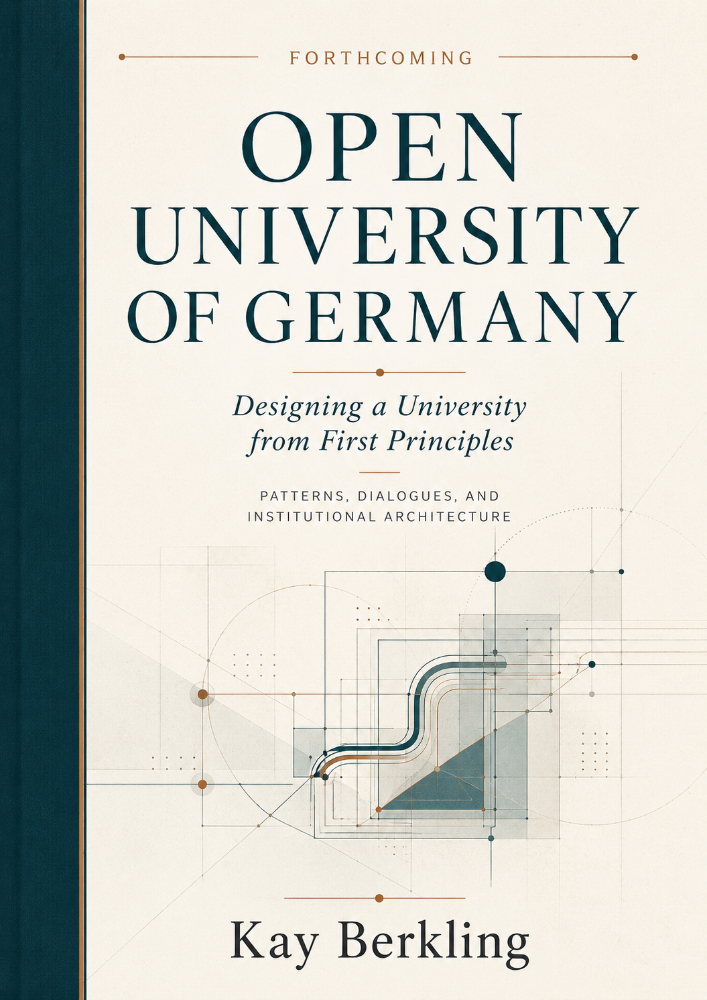

# Open University of Germany

## Designing a University from First Principles

The Open University of Germany (OUG) is a fictive public university federated model designed for a society in which learning no longer follows a single path, at a single pace, or within a single institution.

> **What would a university look like if it were designed around learning first, if we could design from first principles, assuming that there are no inherited structures and money and IT infrastructure wouldn't stop us?**

The OUG is not conceived as a replacement for existing universities. It is designed as a federated, open, and publicly anchored institution that connects them. Its purpose is to make high-quality higher education more accessible, more flexible, and more responsive to learners whose lives do not fit the assumptions of the traditional degree.

This repository contains the evolving institutional architecture of the OUG. 

To understand **why** each element exists, please refer to the book. 
**Designing a University from First Principles**

---

## The Core Proposition

> **When the same difficulties recur across institutions, roles, and reform efforts, the problem may not be the people. It may be the architecture.**

The OUG therefore treats the university as a deliberately designed public institution. Its governance, curriculum, quality assurance, financing, legal structure, and digital infrastructure are developed as parts of one coherent system.

---

## How the Architecture Was Developed

The OUG design emerged from long-term experience across higher education systems, roles, and institutional levels.

Alongside this experience, a series of blank-slate dialogues was conducted with people who hold different forms of insider knowledge: governance practitioners, strategists, curriculum designers, public-sector actors, institutional observers, administrators, and learners.

Each dialogue began with the same question:

> **If you had no financial, political, or IT constraints, and had the power to create a university on a blank slate, what would it look like?**

The dialogue partners were not shown the OUG design and were not asked to evaluate it. Their independently articulated ideas were interpreted into principles and returned to them for verification.

The resulting principles were then compared across perspectives and used to stress-test the emerging OUG architecture.

This work distinguishes between:

- **Founding Principles** — the core commitments from which the OUG was originally born;
  - every person is a student
  - every person has the right to learn
  - it is the duty of the western democratic government to support this financially
  
- **Dialogue-Derived Principles** — first principles independently articulated across the blank-slate dialogues;
  - 42 principles were derived based on open dialogues
  - the interlocuters agreed to the principles that were documented as emerging from the dialogue
  
- **Institutional Design Principles** — structural rules synthesised from the founding principles, dialogues, research, and legal realities;
  ???
- **Antipatterns and Design Patterns** — named recurring failures and reusable counter-designs;
  - in the spirit of Software Engineering, Design Patterns are a way to design software around best practices. They can also be expressed in terms of anti-patterns. Spagetthi code is one such anti-pattern. Patterns support communication at a meta-level about situations because one word (the pattern name) is easier to use than complex descriptions.
    
- **Architectural Decisions** — the specific choices made for the OUG;
  - OUG follows as archtiecture that is a specific implementation. It will adhere to some patterns but not all. Therefore it can have a signature, that describes how well these patterns are implemented. Like software architectures, not all patterns are used all the time. They are carefully chosed for a purpose and composed.
    
- **Implementing Documents** — the statutes, frameworks, regulations, and operating models that make those choices concrete. This repository is designated for their collection that can be very extensive. The main reasoning behind the architectural design can be found in the book. 

---

## Start Here

### Foundations

- [First Principles](00-foundations/first-principles.md)
- [Design Method](00-foundations/design-method.md)
- [Dialogue-Derived Principles](00-foundations/dialogue-derived-principles.md)
- [Institutional Design Principles](00-foundations/institutional-design-principles.md)
- [Pattern Catalogue](00-foundations/pattern-catalogue.md)
- [Terminology](00-foundations/terminology.md)

### Strategy and Purpose

- [Strategy Constitution](01-strategy/strategy-constitution.md)
- [Strategy Framework: Objectives and KPIs](01-strategy/objectives-and-kpis.md)
- [Strategic Decision Protocol](01-strategy/decision-protocol.md)

### Governance and Leadership

- [Governance and Decision Framework](02-governance/governance-architecture.md)
- [Portfolio Governance](02-governance/portfolio-governance.md)
- [Leadership and Stewardship Profiles](02-governance/leadership-stewardship-profiles.md)
- [Participation Architecture](02-governance/participation-architecture.md)

### Legal and Federated Structure

- [Grundordnung](03-legal/grundordnung.md)
- [Federated Legal Model](03-legal/federated-legal-model.md)
- [Federation and Membership Framework](03-legal/federation-membership-framework.md)
- [Legal Questions and Open Issues](03-legal/legal-open-questions.md)

### Academic Architecture

- [Quality Assurance and Academic Governance](04-academic/quality-assurance.md)
- [Examination Regulations](04-academic/examination-regulations.md)
- [Curriculum Architecture](04-academic/curriculum-architecture.md)
- [Module Handbook](04-academic/module-handbook/README.md)

### Finance, Accreditation, and Implementation

- [Financial Model](05-finance/financial-model.md)
- [Financial Assumptions and Scenarios](05-finance/assumptions-and-scenarios.md)
- [Accreditation Requirements Map](06-accreditation/requirements-map.md)
- [Evidence Register](06-accreditation/evidence-register.md)
- [Founding Roadmap](07-implementation/founding-roadmap.md)
- [Risk Register](07-implementation/risk-register.md)
- [Institutional Readiness Assessment](07-implementation/readiness-assessment.md)

The documents are designed to be read independently, but they form one architecture. Each document therefore states its purpose, authority, relationship to other documents, and current status.

---

## Document Status

The OUG is a prospective institutional design and evolving founding prototype.

Documents in this repository may have different levels of maturity:

| Status | Meaning |
|---|---|
| **Conceptual** | A proposed design that has not yet undergone formal review |
| **Drafted** | A complete working draft exists |
| **Internally validated** | Tested for coherence against the OUG principles and architecture |
| **Externally reviewed** | Reviewed by relevant external experts |
| **Legally reviewed** | Reviewed by specialist legal counsel |
| **Adopted** | Formally adopted by a competent body |
| **Operational** | Implemented and tested in practice |

Each document should identify its current status and version.

---

## Why Version Control Matters

A university that understands itself as a learning institution should be able to see how its own architecture changes.

Version control makes institutional reasoning visible. It allows assumptions to be challenged, decisions to be traced, unresolved questions to remain explicit, and improvements to accumulate without erasing their history.

The repository is therefore not simply a publication platform. It is part of the governance design itself.

---

## Contributing

The OUG is being developed as an open institutional architecture.

Constructive critique is welcome, particularly from:

- learners and student representatives;
- universities and academic staff;
- governance and quality-assurance practitioners;
- accreditation and legal experts;
- ministries and public-sector institutions;
- lifelong-learning and recognition specialists;
- digital-learning and interoperability communities.

Please use [Issues](../../issues) to raise questions, identify contradictions, propose improvements, or document risks.

Substantive changes should be linked to the relevant principle, pattern, architectural decision, or requirement wherever possible.

---

## The Standard Against Which the OUG Must Be Judged

The OUG should not be judged by whether the institution remains accountable to learners when resources are scarce, leadership changes, political attention moves elsewhere, and the founding generation is gone.

That is the purpose of the architecture documented here.

---

**Open University of Germany**  
*A prospective for now ficitive public university designed from first principles.*

